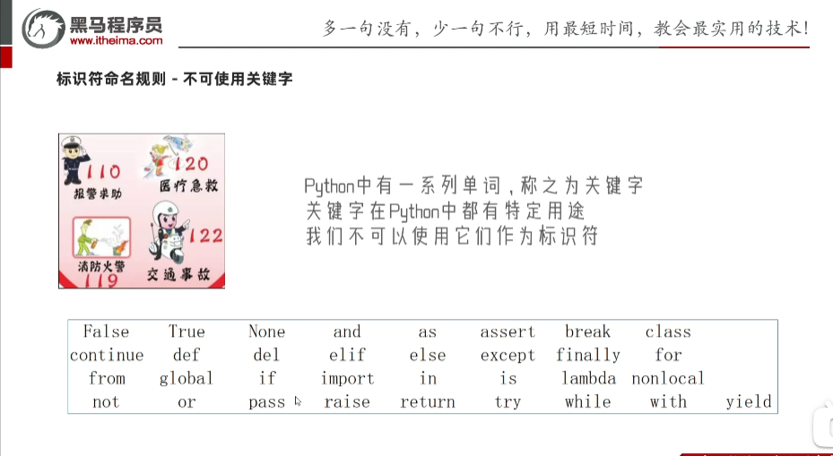
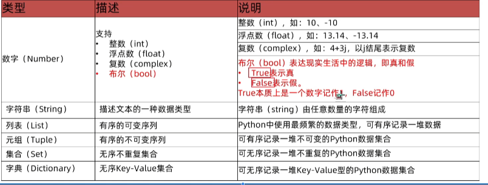

# Python + AI
## 一、数据类型
| 类型                 | 描述           |  说明                             |
| --------------------| ---------------|---------------------------------- |
| string              | 字符串类型      | 用引号引起来的数据都是字符串        |
| int                 | 整型（有符号）   | 数字类型，存放证书 如 -1，10等     |
| float               | 浮点型（有符号） | 数组类型，存放小数，如 -3.14、6.66 |
### 二、type语句查看数据的类型
```python
print(type('黑马程序员')) # str
print(type(666))  # int
print(type(11.345)) # float
```
疑问：变量有类型吗？
我们通过type(变量)可以输出类型，这是查看变量的类型还是数据的类型？
查看的是：变量存储的数据类型。因为变量无类型，但是它存储的数据有类型。

### 三、数据类型转换
数据类型之间，在特定的场景下，是可以互相转换的，如字符串转数字、数字转字符串等
| 语句(函数)   | 说明       |
| ------ | ---------------- |
| int(x) | 将x转换为一个整数       |
| float(x) | 将x转换为一个浮点数   |
| str(x)  | 将对象x转换为字符串 |
类型转换注意事项：
类型转换不是万能的，我们需要注意：
1. 任何类型，都可以通过str(),转换成字符串
2. 字符串内必须真的是数字，才可以将字符串转换为数字（不然会报错）

## 三、什么是标识符
在Pyton程序中，我们可以给很多东西起名字，比如：
1. 变量的名字
2. 方法的名字
3. 类的名字，等等
这些名字，我们把它统一的称之为标识符，用来做内容的标识。

标识符命名规则-内容限定
标识符命名中，只允许出现：
1. 英文
2. 中文
3. 数字
4. 下划线（_）
这四类元素
其余任何内容都不被允许。
注意：
1. 不推荐使用中文
2. 不能以数字开头
3. 大小写敏感
```python
# 以定义变量为例：
Andy = "安迪1"
andy = "安迪2"
# 字母a的大写和小写，是完全能够区分的
```
4. Python中有一系列单词，称之为关键字，关键字在Python中都有特定用途，我们不可以使用它们作为标识符



5. 变量命名规范-见名知意
   变量的命名要做到：
   明了：尽量做到，看到名字，就知道是什么意思
   简洁：尽量在确保"明了"的前提下，减少名字的长度
6. 下划线命名规范-下划线命名法
   多个单词组合变量名，要使用下划线做分割
```python
first_number = 1
student_nickname = '小明'
```
7. 英文字母全小写
8. 命名变量中的英文字母，应全部小写：
```python
name = '张三'
age = 11
```
### 四、算数（数学）运算符
基础运算符

| 运算符   | 描述             | 实例                               |
| ------ | ---------------- | ---------------------------------- |
| +      | 加               | 两个对象相加 a+b 输出结果30         |
| -      | 减               | 得到负数或是一个数减去另一个数a-b输出结果 -10    |
| *      | 乘               | 两个数相乘                         |
| /      | 除               | 两个数相除                       |
| //     | 取整除           | 除后取整                         |
| %      | 取余             | 返回除法的余数 b%a 输出结果为0              |
| **      | 指数            | a**b为10的20次方                        |

赋值运算符

| 运算符 | 描述 | 实例                        |
| ------ | ---- | --------------------------- |
| =     | 赋值运算符   | 把 = 号右边的结果 赋给 左边的变量，如 num = 1+2*3, 结果num的值为7 |

复合赋值运算符

| 运算符 | 描述       | 实例                          |
| ------ | ---------- | ---------------------------- |
| +=      | 加法赋值运算符 | c += a 等效于 c = c + a  |
| -=      | 减法赋值运算符 | c -= a 等效于 c = c - a  |
| *=      | 乘法赋值运算符 | c *= a 等效于 c = c * a  |
| /=      | 除法赋值运算符 | c /= a 等效于 c = c / a  |
| %=      | 取模赋值运算符 | c %= a 等效于 c = c % a  |
| **=      | 幂赋值运算符 | c **= a 等效于 c = c ** a  |
| //=      | 取值除赋值运算符 | c //= a 等效于 c = c // a  |

### 五、字符串三种写法和转义字符
字符串在Python中有多种定义形式：
1. 单引号定义法：name='黑马程序员'
2. 双引号定义法：name="黑马程序员"
3. 三引号定义法：name="""黑马程序员"""
   三引号定义法，和多行注释的写法一样，同样支持换行操作
   使用变量接受它，它就是字符串
   不使用变量接收它，就可以作为多行注释使用。

扩展 转移字符串(/)
```python
address3 = "\"深圳创维\""  # 将"的特殊功能取消，即："深圳创维"
address4 = "\"深圳\n\""    # \n 提供换行功能，即： "深圳
                                                      创维"
 ```
### 六、字符串-使用加号拼接字符串，使用 * 号倍率增加字符串
```python
print('黑马程序员'+'666')
name = "周杰伦"
age = 11
height = 170
# info = "我是" + name + ", 今年" + age + "岁，身高" + height + "厘米"  # TypeError: can only concatenate str (not "int") to str  字符串不能拼接数字不然会报错，需要转成字符串再拼接
info = "我是" + name + ", 今年" + str(age) + "岁，身高" + str(height) + "厘米"
print(info) # 我是周杰伦, 今年11岁，身高170厘米

# 字符串倍数增加
str = '+' * 10 
print(info) #  输出： ++++++++++

# 字符串换行拼接
info = ("我是" + name + ", 今年"
        + str(age) + "岁，身高"
        + str(height) + "厘米")
print(info) # 我是周杰伦, 今年11岁，身高170厘米
```

### 七、字符串格式化
我们可以通过如下语法，完成字符串和变量的快速拼接。
```python
name = '小明'
age = 20.5
height = 172.55
# info = "我是%s,今年%s岁，身高(cm)：%s" % (name, age, height) # 我是小明,今年20.5岁，身高(cm)：172.55
info = "我是%s,今年%d岁，身高(cm)：%.1f" % (name, age, height) # 我是小明,今年20岁，身高(cm)：172.6
print(info)
```

其中的。 %s
- % 表示：我要占位
- s 表示：将变量变成字符串放入占位的地方
  所以综合起来的意思是：我先占个位置，等一会有个变量过来，我把它变成字符串放到占位的位置

  python中，其实支持非常多的数据类型占位
  最常用的是如下三类：
| 格式符号 | 转化       | 
| ------ | ---------- | 
| %s      | 将内容转换成字符串，放入占位的位置 |
| %d     | 将内容转换成整数，放入占位的位置 |
| %f     | 将内容转换成浮点数，放入占位的位置 |

字符串格式化 - 数字精读控制
我们可以使用辅助符号"m.n"来控制数据的宽度和精读
- m,控制宽度，要求是数字（很少使用,一般用于输出的样式对齐），设置的宽度小于数字自身，不生效
- .n,控制小数点精读，要求是数字，会进行小数的四舍五入
示例：
- %5d: 表示将整数的宽度控制在5位，如数字11，被设置为5d，就会变成：[空格][空格][空格]11,用三个空格补足宽度。
- %5.2f：表示将宽度控制为5，将小数点进度设置为2
  小数点和小数部分也算入宽度计算。如，对11.234设置了%7.2f后，结果是：[空格][空格]11.35。2个空格补足宽度，小数部分限制2为精读后，四舍五入为 .35
- %.2f：表示不限制宽度，只设置小数点精度为2，如11.345设置%.2f后，结果是11.35

字符串 f_format 格式化方式
目前通过%符号占位已经很方便了，还能进行精读控制。
可是追求效率和优化的Python, 还有更加优雅的写法：
语法：f"内容{变量:10.1f}"的格式来快速格式化
这种方式：不理会类型，但可以做精读控制
代码如下：
```python
name = '小明'
age = 20.5
height = 172.55
print(f"我是{name},今年{age}岁,身高{height:10.1f}cm") # 我是小明,今年20.5岁,身高172.6cm
```

### 八、input语句（函数）
使用示例：
```python
name = input()
print("Get!!!你是：%s" % name)
# 输入数字  
age = int(input("请输入年龄：")) # 输入框输入的是字符串，要转成数字
age += 10
```

### 八、布尔类型和比较运算符
Python中常用的有6种值(数据)类型


布尔类型的定义：
布尔类型的字面量：
- True 表示真
- False 表示假

比较运算符：

  
