# css

## grid布局

一、grid的基本介绍
1、基本定义
flex布局是轴线布局，只能指定"项目"针对轴线的位置，可以看作是一维布局，Grid布局则是将容器划分成“行”和“列”，产生单元格，然后指定“项目所在”的单元格，可以看作是二维布局，grid布局远比flex布局强大。如下图就是典型的Grid布局。
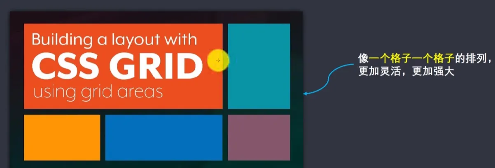
2、布局方式-常用三种：
1、传统布局方式
利用position属性+display属性+float属性布局，兼容性最好，但是效率低，麻烦
2、flex布局
有自己的一套属性，效率高，学习成本低，兼容性强。
3、grid布局
网格布局是最强大的 CSS 布局方案，但是知识点较多，学习成本相对困难些，目前的兼容性不如flex好。
3、grid的基本概念：
容器和项目，如下图所示
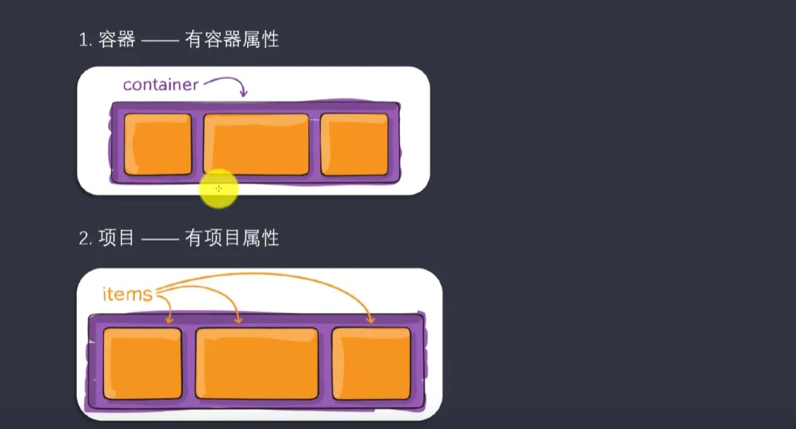
所有的基本概念，更利于了解布局
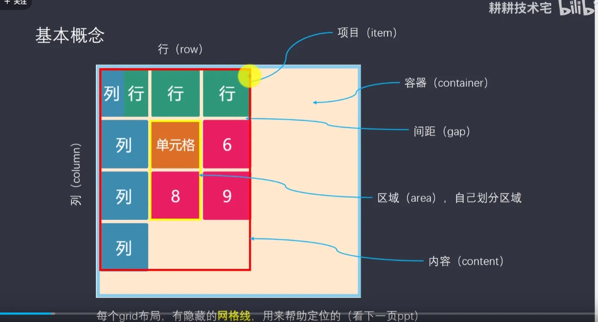

二、用法介绍
1、容器属性 grid-template-*
你想要多少行或者多少列，就填写相应属性值的个数，不填写，自动分配, 以下属性同样适用于行
1、 grid-template-columns:100px 100px 100px;  表示三列每列宽度100px
1.1、 repeat(3,100px) 表示重复三次 100px，即三列布局，每列100px。;
1.2、repeat(auto-fill,100px) 表示每列宽度100px，布满一行换行。;
1.3、fr 为了方便表示比例关系，网格布局提供了 fr 关键字（fraction  的缩写，意味“片段”）
grid-template-columns: 1fr minmax(150px 1fr)  表示宽度平均分成4份;
1.4、grid-template-columns: 1fr minmax(150px,1fr) 1fr; 表示三列，其中第二列最小宽度为150px;
1.5、auto布局：grid-template-columns: 100px auto 100px;  表示三列，左右两列宽度固定，中间列宽度占满
剩余宽度；
1.6、网格线，可以用方括号定义网格线名称，方便以后的引用
grid-template-columns:  [c1] 100px  [c2] 100px  [c3] 100px [c4];
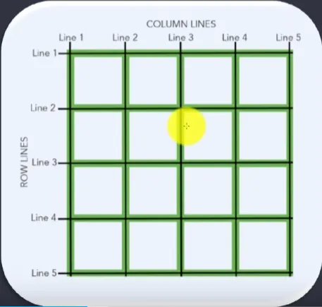

2、 gtid-tamplate-rows: 100px 100px 100px; 表示三行，每一行的高度为 100px
如下如所示：
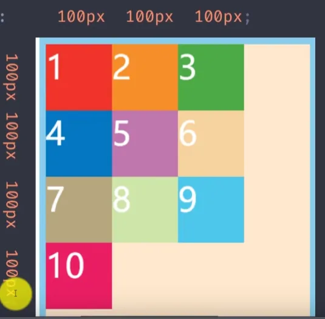

2、容器属性  grid-row-gap / grid-column-gap
一句话解释解释，item（项目）相互之间的距离
grid-column-gap: 20px; 列间距
grid-row-gap: 20px;  行间距
grid-gap:20px;  行列间距
注意：根据最新标准，上面三个属性名的 grid- 前缀已经删除
3、容器属性 grid-template-areas
一个区域有单个或多个单元格组成，有你决定（具体使用，需要在项目属性里面设置）
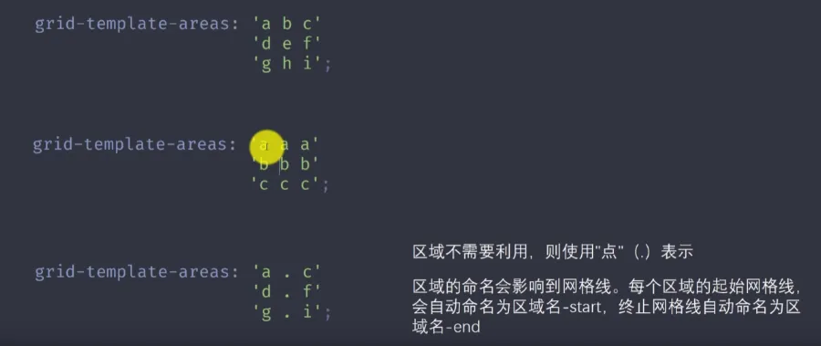
4、容器属性 grid-auto-flow
划分网格以后，容器的子元素会按照顺序，自动放置在每一个网格。默认的放置顺序是“先行后列”，即先填满第一行，再开始放入第二行（就是子元素的排放顺序），行和列的具体表现方式如下：
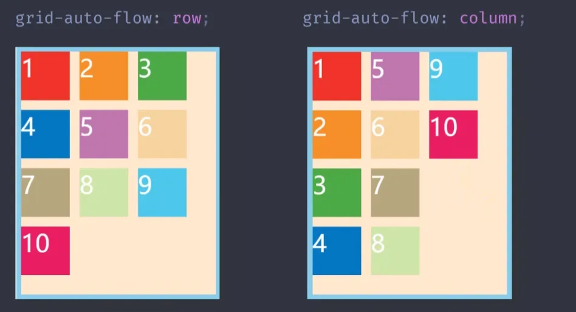
grid-column:1/3; 表示该网格项从第1条线开始，延伸到第3条列线结束。
grid-auto-flow: row dense;  
row：表示网格按行优先的顺序 排列；
dense: 表示“密集”填充模式；如果网络容器中有空闲的空间，浏览器会尝试用后续的网格项填充这些空隙；这可能会导致网络项的顺序与它们在HTML中的顺序不一致。
5、容器属性 justify-items(水平方向) /  align-items (垂直方向)
设置单元格内容水平和垂直的对其方式
其中 stretch 表示铺满单元格
justify-items:start | end | center | stretch;
6、容器属性 justify-content （水平方向）/ align-content（垂直方向）
设置整个内容区域的水平和垂直的对齐方式

7、容器属性 grid-auto-columns  / grid-auto-rows
用来设置多出来的项目 宽和 高
grid-auto-rows:50px;  
我只设置了 3X3个项目，但是实际有10个，整个属性就是用来设置多出来的项目，实际效果如下图所示：
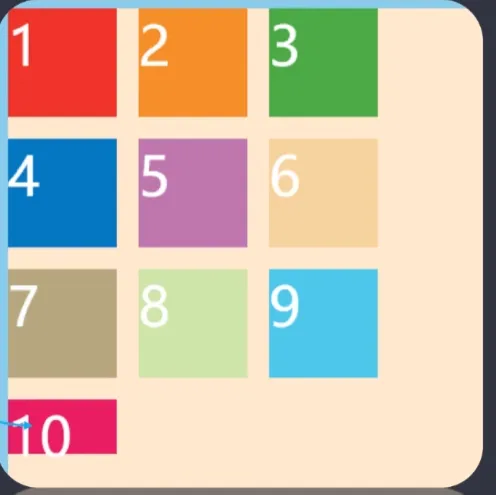
8、项目属性
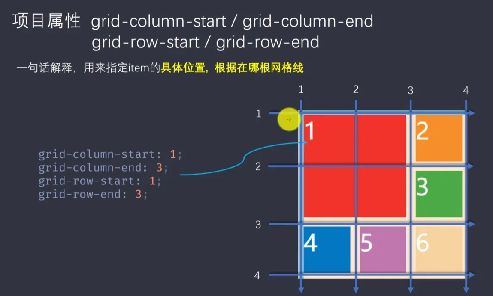
跟上面相同效果的另一种写法：
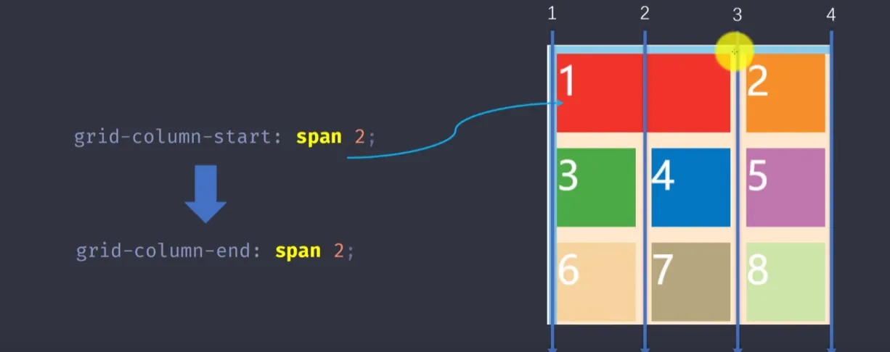
9、项目属性 grid-area
多个指定项目的合并
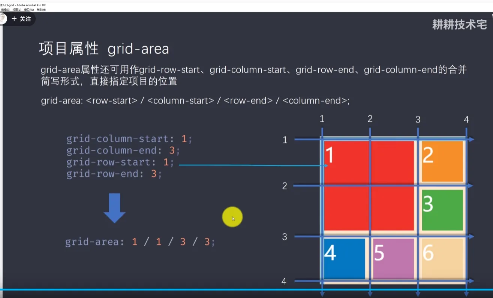
10、项目属性：justify-self / align-self / place-self  单个单元格的对齐方式
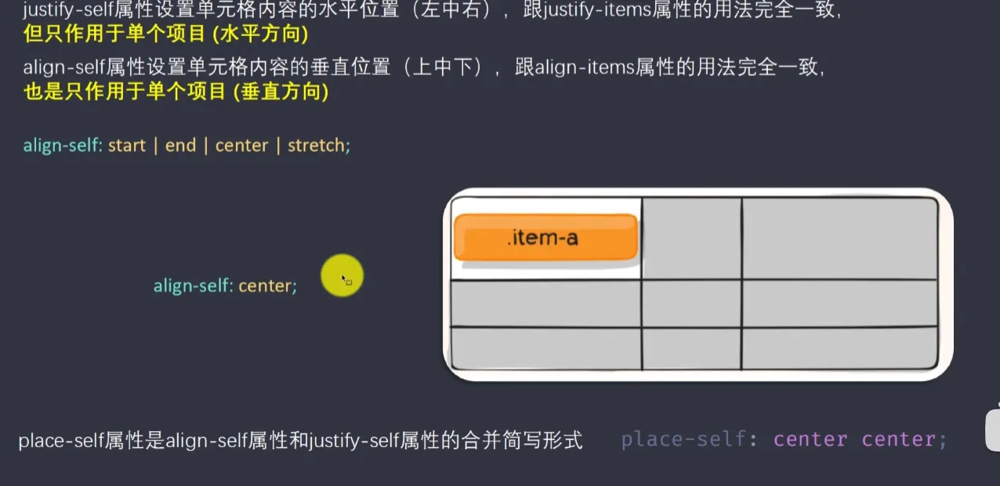
