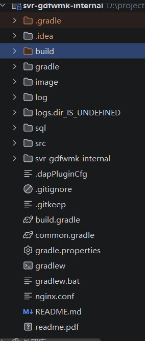
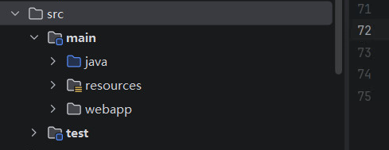
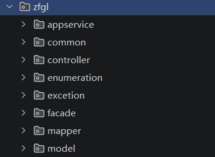

# Java Web项目结构

## Java Web项目结构 解析


核心目录说明：
|   目录/文件   |    作用    |
|---------------|------------|
| src/ | 存放所有Java源码和配置文件（最重要） |
| build/| Gradle编译后的输出目录(.class文件、打包的jar/war) |
| .idea/| intelliJ IDEA的项目配置文件（IDE专用） |
| gradle/| Gradle Wrapper的文件夹，包含 JAR 和配置文件 |
| sql/| 数据库脚本文件（建表、初始化数据等） |
| image/| 可能存放图片资源或Docker镜像相关文件 |
| log/和logs.dir_IS_UNDEFINED| 日志文件存放目录 |
| svr-gdfwmk-internal/| 可能是子模块或生成的应用目录 |

关键配置文件
|   文件   |    作用    |
|---------------|------------|
| build.gradle | Gradle构建脚本(依赖管理、插件配置) |
| common.gradle | 公共Gradle配置（可能被多个模块共享） |
| gradle.properties | Gradle属性配置（JVM参数、版本等） |
| gradlew/gradlew.bat | Gradle Wrapper脚本（跨平台执行 Gradle 命令） |
| nginx.conf | Nginx配置文件(可能用于反向代理或静态资源) |


|   文件   |    作用    |
|---------------|------------|
| java | java源码 |
| resources | 配置文件 |
| webapp | 前端资源 |
| test/java | 单元测试 |

### 权限模块结构和代码详解

#### 业务模块代码结构解析

解析：这是一个项目的其中一个业务模块，这是典型的分层+模块化的 Spring Boot 项目结构，zfgl模块内部遵循了MVC三层架构的扩展
- appservice: 应用服务层，通常封装用例或业务流程，协调多个领域服务完成业务操作
- common：公共组件，如工具类、常量、通用配置、全局返回值封装等
- controller：控制层，接收 HTTP 请求，参数校验，调用服务层并返回响应
- enumeration: 枚举类，定义状态码、业务类型、错误码等常量枚举
- exception：自定义异常及全局异常处理器
- facade：外观层,用于对外提供粗粒度的接口(可对内调用 appservice 或整合多个服务， 常用于简化外部调用)
- mapper：数据访问层(MyBatis),定义数据库操作的接口或SQL映射
- model: 实体类或数据传输对象(DTO/DO/VO), 包括数据库表映射的POJO、请求/响应模型等

#### 结算单归集配置增删改查代码解析


##### 结算单归集配置查询代码解析
1. 门面文件 PayBillRuleManagerFacade.java
```java
/**
 * @Service的作用就是告诉 Spring:这个类是我的业务逻辑服务类，请把它托管到容器中，以便我可以在其他地方直接使用。
 * values属性：显示指定 Bean 名称，如果不指定，默认使用类名首字母小写
 */
@Service(value = "payBillRuleManagerFacade")
/**
 * PayBillRuLeManagerFacade 遵循门面模式命名，对上层(如Controller)提供统一简化接口
 * 继承了泛型抽象类 AbstractPayBillRuLeManagerFacade<PayBillRuLeManagerVO>
 * 泛型：类在定义时使用<T>等类型占位符，在使用时指定具体类型，提高代码复用和类型安全
 * 抽象类：用 abstract 修饰，不能直接实例化，可以包含抽象方法和具体方法
 */
public class PayBillRuLeManagerFacade extends AbstractPayBillRuLeManagerFacade<PayBillRuLeManagerVO> {
   /**
    * 生单规则列表查询
    * @param qryCond 查询对象
    * @return ResultResponse
    */
   @0verride
   public ResultResponse listCreateBillRule(BillRuleQryReqVo qryCond) {
     log.info('测试')
     /**
      * 调用父类提供的模板方法，返回 List<ElecBillCreateRuleVO>
      * baseListListCreateBillRule(qryCond)
      */
     List<ElecBillCreateRuleVO> ruleVOS = baseListListCreateBillRule(qryCond);
     return ResultResponse.success( msg:"success", ruleVos);
   }
}
```java


2. 控制层文件 AbstractPayBillRuleManagerController.java
```java
/**
 *  门面模式
 */
// 设定这个控制器类中所有请求处理的公共 URL 前缀
@RequestMapping("/elecManager/payBillRuLe"）
public abstract class AbstractPayBillRuLeManagerControLLer<T extends PayBillRuLeManagerVO> extends PlatformQueryControlLer<PayBilLRuLeManagerVO> {
@0verride
protected PayBillRuLeManagerFacade getFacade(){
  return PayBillRuLeManagerFacade
}

/**
 *  推单规则列表查询
 *  @param qryCond 查询对象
 *  @return ResuLtResponse
 */
// 来自 Swagger 的注解，用于生成 API 文档，说明该接口的功能时 "推单规则列表查询"
@ApiOperation("推单规则列表查询")
// 将 HTTP POST 请求映射到路径 /listPushBillRule,客户端通过POST方式调用此接口
@PostMapping("/listPushBillRule")
/**
 * @RequestBody(required = true) 表示请求体必须包含 JSON 数据，并自动反序列化为 BillRuleQryReqVO 对象。 
 * required = true 意味着请求体不能为空。
 * 
 * 参数对象：BillRuleQryReqVO qryCond
 *   命名遵循VO 版本后缀，可能表示该接口的请求参数模型版本。
 *   该类通常包含页面信息、筛选条件
 * 
 * 返回值：ResultResponse 自定义的统一响应封装类，保证了前端对响应格式的一致性处理
 */
   public ResultResponse listPushBillRule(@RequestBody(required = true) BillRuleQryReqVO qryCond) {
   /**
    * 方法实现：
    *  getFacade(): 通过继承基类或注入依赖获得一个 Facede 层对象(门面模式)
    */
   return getFacade().listPushBillRule(qryCond);
 }
}
```

3. 
```java

package com.gdfw.zfgl.model;
import com.comtop.platform.rt.base.model.PlatformQueryVO;

public class PayBillRuleManagerV0 extends PlatformQueryV0 {
     /
     * 构造方法
     */
     public PayBillRuLeManagerVo(){
     
     }
     /**序列化ID*/
     private static final long serialVersionUID = 1L;
     /**
      * 支付规则管理服备VO的toStning方法
      * @return 支付规则管理服备vo的tostning值
      */
     @0verride
     public String toString() { 
      return super.toString();
   }
}
```


归集结算单配置 表格导出
```java 
// 是 Java 标准库(他是JDK的一部分，不需要额外下载)中用于对字符串进行 application/x-www-form-urlencoded 编码的工具类，就是把普通文本转换成可在 URL 中安全传输的格式
import java.net.URLEncoder
// 是 Spring Framework 中的类，具体属于 spring-core 模块，他是Spring框架自带的资源加载工具，用于访问类路径下的资源文件
import org.springframework.core.io.ClassPathResource;
import com.alibaba.excel.EasyExcel;import com.alibaba.excel.ExcelWriter;
import com.alibaba.excel.write.handler.WriteHandler;
import com.alibaba.excel.write.metadata.WriteSheet;
import com.alibaba.excel.write.metadata.fill.FillConfig;
import com.alibaba.excel.write.style.column.SimpLeCoLumnWidthStyleStrategy;

@PostMapping("/export/createBillAllData")
// throws Exception 方法可能抛出异常，由上层处理
public void createBillAtlData(@RequestBody(required = true) BitlRuLeQryReqVO qryReq, HttpServletResponse response) throws Exception {
   String fileName = "生单规则";
   /**
    * 对中文文件名进行URL编码，避免下载时乱码
    */
   String encodeFileName = URLEncoder.encode(fileName, StandardCharsets.UTF_8.nameO).replaceAll( regex:"\\+", replacement: "%20");
   ClassPathResource classPathResource = new ClassPathResource("'excel/template/" + fileName + ".xlsx'");
   if (!classPathResource.existsO) {
      log.error（"导出失败文件模板不存在";
      response.setContentType("application/json;charset=utf-8");
      response.setCharacterEncoding("'utf-8");
      response.setStatus(HttpServLetResponse.SC_INTERNAL_SERVER_ERRoR);
      response.getWriter().write( s:"导出失败,文件模板不存在");
      return;
   }
   // 2.设置下载响应头
   response.setContentType("application/vnd.openxmlformats-officedocument.spreadsheetml.sheet;charset=utf-8");
   response.setCharacterEncoding("'utf-8");
   // 再次确保字符编码
   response.setHeader( name:"Content-disposition", value:"attachment;filename*=utf-8'i" + encodeFileName + ".xlsx");
   // 添加固定列宽策略，禁用自动列宽计算，解决Linux字体初始化报错  设置固定列宽 20 个字符宽度
   // 这样可以避免 Linux 环境中因为没有字体而自动计算列宽时抛异常
   WriteHandLer coLumnWidthHandLer = new SimpleColumnWidthStyLeStrategy(20);
   // 获取输出流和模板输入流
   try (OutputStream os = response.get0utputStream();
   InputStream templateIs = classPathResource.getInputStream()) {
   // 3.用模板+流式写入
   ExcelWriter excelWriter = EasyExcel.write(os)
   withTemplate（templateIs）//加载模板
   .registerWriteHandLer（columnWidthHandLer）//注册固定列宽策略
   .build();
   WriteSheet sheet = EasyExcel.writerSheet().build();
   FillConfig fitlConfig = FillConfig.builder(）.forceNewRow(Boolean.TRUE).build();
   //4.查询数据（生单数据）
   List<ElecBillCreateRuleExcelV0> dataList = getFacade().listCrateBillExportData(qryReq);
   //写入Excel（追加，不占内存）
   excelWriter.fill(dataList,fillConfig， sheet);
   //5.完成关闭
   excelWriter.finish();
   // 强制刷新输出流，确保数据完全发送到客户端
   os.flush();
} catch (Exception e) {
  log.error("导出失败"，e);
  response.reset(）;
  response.setContentType("application/json;charset=utf-8");
  response.setCharacterEncoding("utf-8");
  response.setStatus(HttpServletResponse.SC_INTERNAL_SERVER_ERRoR);
  response.getWriter(）.write( s:"导出失败："+ e.getMessage());
}
}
```

## spring Boot 项目架构核心概念解析
### 代码解析
项目主入口文件 SpringBootStarter.java：
总结：
- 项目内的代码：src/main/java/ + 包名(点变斜杠)
- 项目外的依赖：Gradle/Maven 本地仓库缓存
- 第三方依赖包在项目中根目录中  外部库 有显示
- 注解的概念：注解是Java的一种元数据，可以把它理解成代码打的标签，它本身不执行逻辑，而是告诉框架或编辑器如何处理这段代码，类似与ts中的装饰器
```java
// 包声明 表示这个类放在 com/gdfw目录下 简单记：package就是告诉Java"这个文件放在哪个文件夹里"
package com.gdfw;
// 导入公司内部框架的配置基类
import com.comtop.bizp.dart.framework.init.DartDefaultScanConfig;
// 导入公司内部启动辅助类
import com.comtop.bizp.dart.framework.start.DartStartMain;
// 导入 MyBatis 的 Mapper 扫描注解
import org.mybatis.spring.annotation.MapperScan;
// 导入自动配置排除过滤器
import org.springframework.boot.autoconfigure.AutoConfigurationExcludeFilter
// 导入 Spring Boot 核心注解
import org.springframework.boot.autoconfigure.SpringBootApplication;
// 导入类型排除过滤器
import org.springframework.boot.context.TypeExcLudeFilter;
// 导入 Fegin 远程调用注解
import org.springframework.cloud.openfeign.EnableFeignClients;
// 导入组件扫描注解
import org.springframework.context.annotation.ComponentScan;
// 导入 ComponentScan 内部 Filter 类
import org.springframework.context.annotation.ComponentScan.Filter;
// 导入过滤器类型枚举 
import org.springframework.context.annotation.FilterType;
// 导入腾讯微服务框架 TSF 注解
import org.springframework.tsf.annotation.EnableTsf;

// Spring Boot 启动核心注解
@SpringBootApplication
// 扫描com.comtop和com.gdfw两个包，排除两个内部过滤器(防止重复扫描)
@ComponentScan(basePackages = { "com.comtop", "com.gdfw" }, excludeFilters = {
@Filter(type = FilterType.CUSToM, classes = TypeExcludeFilter.class),
@Filter(type = FilterType.CUSToM, classes = AutoConfigurationExcludeFilter.class)})
// 开启腾讯微服务框架 TSF
@EnableTsf
// 开启 Fegin 远程调用，扫描指定包下的客户端接口
@EnableFeignClients(basePackages = { "com.comtop", "com.gdfw" })
// 扫描 MyBatis Mapper 接口， **表示任意层级子目录
@MapperScan(basePackages = {"com.gdfw.**.mapper"})
// 启动类，继承公司内部配置基类
public class SpringBootStarter extends DartDefaultScanConfig {
/**
*@param args 参数
**/
public static void main(String[l args）{
  // 调用公司封装的 DartStartMain.run() 启动 Spring Boot应用
  DartStartMain.run(SpringBootStarter.class, args);
}
```
### java运行依赖环境是什么
1. 最核心的就是 JDK（Java Development Kit）
```java
JDK 
   |---JRE
   |    |--JVM
   |    |--核心类库
   |----开发工具（javac，jar 等）
```
2. 作用明细
|   组件   |    作用    |    类比前端的    |
|---------------|------------|------------|
| JDK | 开发和运行Java程序的环境 | Node.js |
| JVM | 运行Java字节码的虚拟机(JDK已包含) | Chrome的V8引擎 |
| JRE | 只运行不开发时用(JDK已包含) | 类似精简版Node |
| javac | 将 .java源码编译成 .class字节码 | tsc编译器 |
| java | 启动JVM运行 .class 或 .jar 文件 | node(运行JS文件) |
| jar | 将多个 .class 文件打包成 .jar 压缩包 | npm run build + 打包工具(webpack/vite) |
| javadoc | 从源码注释生成API文档 | jsdoc/typedoc |
3. jdk安装验证
```cmd
java -version
```
### java项目跑起来的完整流程
写代码(.java) => 编译(.class) => 打包(.jar) => 运行(JVM执行)
### 什么是 spring Boot
Spring Boot 是一个基于 Java 的后端框架，用来快速构建 Web 应用程序和微服务。你可以把它理解为 Java 后端"Express.js/Nest.js"
### 什么是是 gradle,java构建工具
Gradle是什么？
Gradle是java世界的自动化构建工具，负责管理项目的编译、测试、打包、依赖管理等全流程，手动管理这些java项目运行非常麻烦，Gradle帮你一键搞定
Java主要有两个构建工具：
|   对比   |    Maven    |    Gradle    |
|---------------|------------|------------|
| 配置文件 | pom.xml（xml格式） | build.gradle（Groovy/Kotlin格式） |
| 语法 | 臃肿，但规范 | 简洁，灵活 |
| 性能 | 较慢 | 更快(增量编译) |
| 学习曲线 | 平缓 | 稍陡 |
| 市场占比 | 传统企业多 | Android/Spring 生态流行 |
### 前端 vs Java对照表
|   前端概念   |    Java对应概念    |
|---------------|------------|
| Node.js | JDK |
| npm | Gradle/Maven |
| package.json | build.gradle 或 pom.xml |
| node_modules | Maven本地仓库(~/.m2) |
| .js文件       | .java文件 |
| 浏览器/v8引擎 | JVM |
| npm run build | ./gradlew build |
| node server.js | java -jar app.jar |
| 依赖安装 | 依赖自动下载(通过 Gradle/Maven) |
### spring Boot框架实现一个简单的接口怎么实现，需要了解什么技术只是，以及如何注入到启动项
写一个简单的接口：
```java
// 作用：声明当前类所在的包(package) 
package com.gdfw.demo;
// 导入 Spring Web 包下所有的注解 
// 作用：提供用于处理HTTP请求、绑定请求数据、定义控制器
import org.springframework.web.bind.annotation.*;
/*
 作用：标记这个类是一个 REST 风格的控制器
 REST 是一种通过标准 HTTP 方法操作 URL 标识的资源的架构风格，把一切数据或服务抽象为资源，每一个资源都有一个唯一的地址。
 客户端通过 HTTP 方法对资源进行操作。
 相当于告诉 Spring: 这个类里每个方法的返回值会直接写入 HTTP 响应体
*/ 
@RestController
/**
 * 设定这个控制器类中所有请求处理的公共 URL 前缀
 */
@RequestMapping("/hello"）
// 定义公共类，类似于 js 的class类
public class HelloController {

  // 限定该方法仅处理 HTTP GET 请求
  @GetMapping("/ping'")
  // 方法返回一个字符串 "pong"
  public String ping() {return "pong";}
  
  // 处理get请求
  @GetMapping("/{name}")
  // @PathVariable 从 URL 路径中提取{name}值，并赋值给参数name
  public String sayHello(@PathVariable String name){
    return "你好," + name;
  }
  
  /**
   * @RequestBody 把HTTP请求体的内容绑定到参数message上
   * 注意：这里参数类型是 String,所以Spring会直接读取整个请求体并赋值给message
   * 常见用法：如果请求体是 JSON，可以写成 @RequestBody User user，Spring会自动反序列化成对象
   */
  @PostMapping("/echo")
  public String echo(@RequestBody String message){
      return "收到："+ message;
  }
}    
// AbstractElecTsPayMainController.java 文件
```java
@ApiOperation（"重新发起发票支付池数据"）
@PostMapping("/reCreatePayBitl")
public Boolean reCreatePayBill(@RequestBody GenInvoiceDataVO params） {
  return getFacade().reCreatePayBill(params);
}
```
// ElecTsPayMainFacadejava.java 文件
```java
@Override
// 返回类型：Boolean(包装类)，返回 true 或 false, 通常表示操作成功或失败
public Boolean reCreatePayBill(GenInvoiceDataV0 params） {
  // 调用 params 对象的 getBureauCode() 方法，获取机构代码
  String bureauCode = params.getBureauCode();
  // 获取付款单号
  String payBillNo = params.getPayBillNo();
  List<String> payBillNoList = new ArrayList<String>();
  List<String> settleBillList = new ArrayList<String>();
  payBillNoList.add(payBillNo);
  // 作用：根据付款单号和机构代码，查询出对应结算单明细列表
  List<ElecTsPayDetailVO> detailVoList = detalfacade.querySettleNoByPaybill(payBillNoList, bureauCode);
  // 增强 for 循环(for-each)，遍历 detailV0List 中的每一个 ElecTsPayDetaiLV0 对象 
  // 每次循环当前对象赋值给循环变量v0
  // 循环结束后，settleBillList 包含了该付款单关联的所有结算单 ID.
  for (ElecTsPayDetaiLV0 vo :detailV0List) {
     settleBillList.add(vo.getSettleBillId());
  }  
  // 复制
  return true;
}
```

// AbstractElecTsPayDetailFacade.java 文件
```java
public List<ElecTsPayDetailVo> querySettleNoByPaybill(List<String> queryV0，String bureauCode）{ 
  return getAppService().guerySettLeNoByPaybill(queryVO, bureauCode);
}
``` 

// ElecTsPayDetailAppService.java 业务层文件
```java
// Spring 框架的注解，将当前类标识为一个 Service 组件，并指定 Bean 的名称为 "elecTsPayDetailAppService"
@Service(value = "elecTsPayDetailAppService")
public class ElecTsPayDetailAppService<T extends ElecTsPayDetailVO> extends AbstractElecTsPayDetailAppService<ElecTsPayDetailVO> {
   @Override
   public List<ElecTsPayDetailVO> querySettleNoByPaybill(List<String> paybillList， String bureauCode){
   //  TempInsertUtil.insertDefauLtGt 方法，将 paybilLList 插入到某个临时表中，用于后续的 SQL 关联查询（常见于使用临时表传递大批量 ID 列表）
   TempInsertUtil.insertDefauLtGt(TempTableEnum.MK_PSM_COMMON_THREAD_TEMP.getKey(), TempTableEnum.THREAD_TEMP_ID.getKey(), paybilLList);
   // 创建 HashMap：实例化一个 Map 对象，泛型为<String, Object>,键是字符串，值是任意对象。用于存放持久查询所需的参数
   Map<String， Object> params = new HashMap<String, Object>();
   // 添加参数：将方法传入的 bureauCode以键bureauCode存入params映射中。这样在执行 SQL 时，可以通过 #{bureauCode}引用该值
   params.put("bureauCode", bureauCode);
   // 将查询得到的 ELecTsPayDetailVO 的列表数据返回给调用者
   List<ELecTsPayDetailVO> objects = getPlatformCommonDAo().queryList( statementld: "com.gdfw.zfgL.model.elecTsPayDetail_querySettleNoByPaybill", params);
   return objects;
 }
}
```

// TempInsertutil.java
```java
// 声明一个名为 TempInsertutil 的 public 类，同时使用 final 修饰符，意味着该类不能被继承(即不能有子类)
// 设计意图：通常此类作为工具类，包含静态方法，final 可防止子类修改其行为
public final class TempInsertutil {
  /**
   * 将数据插入到gt表
   * @param tabName 表名
   * @param list 字段对应数据值
  */
 public static void insertDefaultGt(final String tabName, String colName, final List<String> list) {
    // 创建 VO 对象：实例化 OperGtConVO 类
    OperGtConVO operGtConVO = new OperGtConVO();
    // 设置表名
    operGtConVO.setTabName(tabName);
    // 设置列名，将列名存入 VO 对象，后续操作可能针对某一列进行删除或插入
    operGtConVO.setColName（coLName);
    // 表示将传入的字符串列表设置给 VO 的某个属性（可能是 gids， 代表一组ID或值）
    operGtConVO.setGids(list);
    // 刪除表數據
    getCommonThreadTempFacade().deleteALLGTData(operGtConVo) ;
    // 写入临时表数据
    getCommonThreadTempFacade().insertDefauLtGtData(operGtConVo)
 }
}
```

```java
/**
 *  List<T>: 返回值类型是一个泛型列表，T是类型参数（由调用时传入的条件对象类型决定）
 *  queryDataList：方法名，语义为 "查询数据列表"
 *  T condition：参数，类型为泛型T，代表一个封装了查询条件的对象（如实体类，DTO或查询参数对象）
 */
public List<T> queryDataList(T condition){
    /**
     * 核心逻辑：调用 DAO 层的 queryList 方法
     */
    return this.getPlatformCommonDAO().queryList(PlatformUtil.getSqlKey(condition,"query","List")，condition,condition.getPageNo()，condition.getPageSize()
}
```
小结：
- DAO层全称 Data Access Object(数据访问对象)层，是一种用于封装数据源（数据库、文件、外部API等）访问细节的架构层次。它的核心作用是将业务逻辑
与数据存取操作分离开来；
- Controller(控制层) -> Service(业务层) -> DAO层 -> 数据库

### 发票重新生单


## 项目实战

### 每次改项目代码都要重启项目吗
默认需要重启，但可以配置热更新(热部署)。
Java项目默认没有前端那种即时的热更新，因为编译机制不同，但可以通过工具实现类似效果
重启的核心原因：Java的类一旦加载到 JVM 内存中，就不能随意切换。改代码 = 重新编译 + 重启 JVM
JAVA的热更新方案：Spring Boot DevTools
文件 build.gradle 加一项插件配置
```java
dependencies{
    developmentOnly 'org.springframework.boot:spring-boot-devtools'
}
```
### 如何连接和操作数据库
### 如何实现一个功能接口
### 实现一个学生信息的增删改查接口
- 1. 建表
```sql
-- 创建学生表(表名和字段名都用大写，避免引号问题)
CREATE TABLE "STUDENT_INFO"(
   -- 自增主键 INT IDENTITY(1,1) 自增整数，从1开始每次增加1，作为学生记录的唯一逻辑主键
  "STUDENT_ID" INT IDENTITY(1,1) NOT NULL,
  -- 学号 最大32个字符串，不能为空，且整个表中唯一
  "STUDENT_NO" VARCHAR(32) NOT NULL, 
  -- 学生姓名，最大64个字符 不能为空
  "STUDENT_NAME" VARCHAR(64) NOT NULL,
  -- 性别，固定一个字符，通常用 'F'(女)/'M'(男)
  "GENDER" CHAR(1),
  -- 出生日期 只存储年月日
  "BIRTHDAY" DATE,
  -- 专业名称，最长 128 字符
  "MAJOR" VARCHAR(128),
  -- 记录创建时间
  "CREATE_TIME" TIMESTAMP DEFAULT CURRENT_TIMESTAMP,
  -- 记录最后更新时间
  "UPDATE_TIME" TIMESTAMP DEFAULT CURRENT_TIMESTAMP,
  -- 主键约束，名为 PK_STUDENT_INFO，保证 STUDENT_ID 唯一且非空
  CONSTRAINT PK_STUDENT_INFO PRIMARY KEY("STUDENT_ID"),
  -- 唯一约束，名为 UK_STUDENT_NO 全表唯一(学号不能重复)
  CONSTRAINT UK_STUDENT_NO UNIQUE("STUDENT_NO");
)
```

- 2. 创建对应的实体类(VO)
作用：封装业务数据，对应数据库表结构，作为各层之间传递数据的载体，并常配合 ORM 框架完成持久化操作
新建：StudentInfoVO.java
```java
/**
 * 作用：声明当前类所在包
 * 约定：通常 VO 或实体类放在vo、entity、model等子包。
 */
package com.gdfw.jsgl.model;
/**
 * 作用：引入项目内另一个包中的 PlatformVO 类
 * 继承关系：当前类 StudentInfoVO 意味着 PlatformVO 可能包含通用字段（如：id、createTime、updateTime等），从而实现代码复用
 */
import com.comtop.platform.rt.base.model.PlatformVO;
/**
 * 作用：导入 JPA(Java persistence API)规范中的 @Table 注解
 * 用途：用于指定当前类映射到数据库中的哪一张表
 * 来源：javax.persistence 包是 javaEE/jakarta EE 的标准
 */
import javax.persistence.Table;
/**
 * 作用：声明当前实体对应的数据表名为 STUDENT_INFO
 * 用途：表示日期和时间
 */
import java.util.Date;
/**
 * 作用：声明当前实体类对应的数据库表名为 STUDENT_INFO
 * 效果：ORM框架在操作该实体时，会知道使用这张表
 * 注意：如果表名和类名相同，有时可以省略此注释，框架会自动映射，这里显示指定更安全
 */
@Table(name = "STUDENT_INFO")
/**
 * public：类可以被其他包访问
 * extends: 子类会自动拥有父类的所有 public和protected 字段/方法
 * 父类可能包含通用属性，例如 String creator、Date、createTime 等，避免重复编写
 */
public class StudentInfoVO extends PlatformVO {
   /**
    * 作用：Java 序列化机制使用的版本标识
    * 必要性：当类需要被序列化
    * 值：1L时随意给的，只要在类修改时决定是否更新即可
    */
   private static final long
   serialVersionUID = 1L;

   private Integer studentId;
   private String studentNo;
   private String studentName;
   private String gender;
   private Date birthday;
   private String major;
   private Date createTime;
   private Date updateTime;

   /**
    * 无参构造方法
    * 作用：提供一个公共的无参构造器
    * 必要性：需要有无参构造函数
    */
   public StudentInfoVO(){}

   /**
    *  设置和获取对应字段值
    *  IDEA中一键生成设置获取：在 IDEA 的实体类文件中 快捷键：Alt+Insert => 在弹出的弹窗中选择 Getter and Setter => 然后勾选需要的字段即*  可
    */
   public String getStudentNo(){
    return studentNo;
   }
   public void setStudentNo(String studentNo){
     this.studentNo = studentNo;
   }
}
```
- 3. 创建 Mapper 接口(DAO)
作用：这是一个 MyBatis 的 Mapper 接口文件，作用是为数据库表 STUDENT_INFO 提供基础的增删改查操作
创建文件 StudentInfoMapper.java
```java
package com.gdfw.jsgl.mapper;
import com.gdfw.jsgl.model.StudentInfoVO;
// 引入 MyBatis 的所有注解
import org.apache.ibatis.annotations.*;
import java.util.List;

// @Mapper 核心注解，告诉 Spring 框架这个接口是 MyBatis 的 Mapper,Spring 会在运行时自动生成它的实现类并注册为Bean,供 Service 层注入使用。
@Mapper
public interface StudentInfoMapper {
  @Select("SELECT * FROM STUDENT_INFO WHERE STUDENT_ID = #{studentId}")
  StudentInfoVO selectById(Integer studentId);

  @Select("SELECT * FROM STUDENT_INFO ORDER BY STUDENT_ID")
  List<StudentInfoVO> selectAll();

  @Insert("INSERT INTO STUDENT_INFO(STUDENT_NO, STUDENT_NAME, GENDER, BIRTHDAY, MAJOR, CREATE_TIME, UPDATE_TIME)" + 
  "VALUES (#{studentNo},#{studentName},#{gender},#{birthday},#{major},NOW(),NOW())")
  // @Options: 配置自动生成主键的回写， useGeneratedKeys = true 表示使用数据库自增主键
  @Options(useGeneratedKeys = true, keyProperty = "studentId", keyColumn = "STUDENT_ID")
  int insert(StudentInfoVO vo);

  @Update("UPDATE STUDENT_INFO SET STUDENT_NAME = #{studentName}, GENDER = #{gender}, BIRTHDAY = #{birthday}, MAJOR = #{major}," + "UPDATE_TIME = NOW() WHERE STUDENT_ID = #{studentId}")
  int update(StudentInfoVO vo);

  @Delete("DELETE FROM STUDENT_INFO WHERE STUDENT_ID = #{studentId}")
  int deleteById(Integer studentId);
}
```

- 4. 创建 Service 层
创建文件：StudentInfoService.java
作用：封装业务逻辑、协调数据访问、事务处理、解耦控制器与数据库
```java
package com.gdfw.jsgl.appservice;
// 导入数据访问接口层
import com.gdfw.jsgl.mapper.StudentInfoMapper;
// 导入值对象（数据传输对象）
import com.gdfw.jsgl.model.StudentInfoV0;
import org.springframework.beans.factory.annotation.Autowire;
import org.springframework.beans.factory.annotation.Autowired;
import org.springframework.stereotype.Service;
import org.springframework.transaction.annotation.Transactional;
import java.util.List;

// @Service 标记这是一个Spring 管理的服务层Bean，Spring 会自动创建它的实例并注入到需要的地方
@Service
public class StudentInfoAppService {
   // 依赖注入，Spring自动将 StudentInfoMapper 的实现类注入到此字段中
   @Autowired
   private StudentInfoMapper studentInfoMapper;
   public StudentInfoVo getById(Integer id){s
     return studentInfoMapper.selectById(id);
   }

   public List<StudentInfoV0> getAll {
     return studentInfoMapper.selectAtl();
   }

   // @Transactional 声明式事务管理，方法执行前开启事务，正常执行完提交事务，抛异常则回滚。
   @Transactional
   public int addStudent(StudentInfoVo vo){
     return studentInfoMapper.insert(vo);
   }

   @Transactional
   public int updateStudent(StudentInfoVO vo){
     return studentInfoMapper.update(vo);
   }

   @Transactional
   public int deleteStudent(Integer id){
     return studentInfoMapper.deleteById(id);
   }
}
```

- 5. 创建 controller 层
创建文件：StudentController.java
作用：1、接收前端请求：监听 /api/student 路径下的 HTTP 请求；
     2、解析请求参数：从 URL、请求体、查询参数中提取数据；
     3、调用业务逻辑：委托给 StudentInfoService 处理具体业务
     4、返回响应数据：将结果（JSON或字符串）返回给前端
```java
package com.gdfw.jsgl.controller;
import com.gdfw.jsgl.appservice.StudentInfoAppService;
import com.gdfw.jsgl.modeL.StudentInfoV0;
import io.swagger.annotations.Api;
import org.springframework.beans.factory.annotation.Autowired;
import org.springframework.web.bind.annotation.*;
import java.util.List;
// 表示这个类中的每个方法返回的数据会直接写入 HTTP 响应体
@RestController("studentInfoController")
// 定义这个控制器中所有方法的基础路径
@RequestMapping("/student")
public class StudentInfoController {
  // 依赖注入，Spring自动将 StudentInfoAppService 的实例注入到此字段
  @Autowired
  private StudentInfoAppService studentService;

  @GetMapping("/{id}"
  // 从 URL 路径中提取 {id} 变量的值，自动转换为 Integer
  public StudentInfoV0 getStudent(@PathVariable Integer id) { return studentService.getById(id);}

  @GetMapping（"/list"）
  public List<StudentInfoV0>
  listStudents() {return studentService.getAll();}

  @PostMapping("/add") 
  pubLic String addStudent(@RequestBody StudentInfoV0 vo){
    int rows = studentService.addStudent(vo);
    return rows>？"添加成功"："添加失败";
  }

  @PutMapping("/update"）
  public String updateStudent(@RequestBody StudentInfoV0 vo){
    int rows = studentService.updateStudent(vo);
    return rows >θ？"更新成功":"更新失败";
  }

  @DeleteMapping("/{id}")
  public String deleteStudent(@PathVariable Integer id){
      int rows = studentService.deleteStudent(id);
      returnrows>θ？"删除成功"："删除失败";
  }
}  
```
### 实现一个学生信息、课程、成绩的接口联查功能
- 1. 建表
作用：这两条 SQL 语句创建了课程表和选课记录表，用于实现学生与课程的多对多关系
为什么需要三张表？
如果不建中间表（选课记录表）学生信息表无法存储多门课程（一个学生只能一门课程）
```SQL
-- 课程表
CREATE TABLE"COURSE"(
    "COURSE_ID"   INT IDENTITY(1, 1) NOT NULL,
    "COURSE_NAME" VARCHAR(128) NOT NULL,
    "CREDIT"      INT,
    -- 定义主键约束
    CONSTRAINT PK_COURSE PRIMARY KEY ("COURSE_ID")
);
-- 选课记录表（学生-课程关联）
CREATE TABLE "STUDENT_COURSE"(
  "ID"         INT IDENTITY(1, 1) NOT NULL,
  "STUDENT_ID" INT NOT NULL,
  "COURSE_ID"  INT NOT NULL,
  "SCORE"      INT,
  -- 定义主键约束
  CONSTRAINT PK_STUDENT_COURSE PRIMARY KEY ("ID"),
  --  FOREIGN KEY（"STUDENT_ID") 声明当前 STUDENT_ID 是外键
  CONSTRAINT FK_STUDENT_COURSE_STUDENT FOREIGN KEY （"STUDENT_ID") REFERENCES "STUDENT_INFO"("STUDENT_ID"),  
  -- FOREIGN KEY ("COURSE_ID") 声明当前 COURSE_ID 是外键
  CONSTRAINT FK_STUDENT_COURSE_COURSE FOREIGN KEY ("COURSE_ID") REFERENCES "COURSE"("COURSE_ID")
)
```

- 2. 复杂sql的xml
新建文件：StudentCourseMapper.xml(注意：这个文件不要放在java目录下，放到 src/main/resources/mapper/ 目录下，不然项目扫描不到要做另外配置)
```xml
<!-- XML声明，指定版本和字符编码 -->
<?xml version="1.θ" encoding="UTF-8"?>
<!-- 
  DOCTYPE声明，告诉 MyBatis 使用哪个 DTD(文档类型定义)来验证 XML 格式 
  -//mybatis.org//DTD Mapper 3.0//EN DTD的唯一标识符
  http://mybatis.org/dtd/mybatis-3-mapper.dtd DTD文件的网络地址(实际不需要联网，MyBatis内置了)
-->
<!D0CTYPE mapper PUBLIC "-//mybatis.org//DTD Mapper 3.0//EN" "http://mybatis.org/dtd/mybatis-3-mapper.dtd">
<!-- 根节点 namespace 命名空间，必须与Mapper接口的全限定类名完全一致-->
<mapper namespace="'com.gdfw.jsgL.mapper.StudentCourseMapper">
<！-- 多表联查 SQL -->
<!-- id 必须与接口方法名一致，MyBatis 通过它找到要执行的方法  resultType SQL 查询结果要映射到的Java对象类型(VO类)-->
  <select id="selectStudentWithCourses" resultType="com.gdfw.jsgl.model.StudentWithCoursesVo">
<!-- 
   表别名:看如下定义
    s STUDENT_INFO  学生表
    sc STUDENT_COURSE 选课关联表
    c  COURSE 课程表
 -->  
SELECT
    s.STUDENT_ID,
    s.STUDENT_NAME,
    c.COURSE_ID,
    c.COURSE_NAME,
    c.CREDIT,
    sc.SCORE
FROM STUDENT_INFO s
<!-- 
  LEFT JOIN的作用：
  - 即使学生没有选任何课，也会返回学生信息（课程字段为 NULL）
  - 如果换成 INNER JOIN, 没选课的学生会被过滤掉
 -->
LEFT JOIN STUDENT_COURSE sc ON s.STUDENT_ID = sc.STUDENT_ID
LEFT JOIN COURSE c ON sc.COURSE_ID = c.COURSE_ID
WHERE s.STUDENT_ID = #{studentId}
   </select>
</mapper>
```
- 3. 新建VO响应实体(注意：getter和setter方法使用IDE 快捷键 Alt+Insert 一键生成， 不写上去了)
新建文件：CourseVO.java
```java
package com.gdfw.jsgl.model;
public class CourseVo{
  private Integer courseId; 
  private String courseName; 
  private Integer credit； 
  private Integer score;
}
```
新建文件：StudentWithCoursesV0.java
```java
package com.gdfw.jsgl.model;
import java.util.List;
import com.gdfw.jsgL.model.CourseV0;

public class StudentWithCoursesV0 {
   private Integer studentId；
   private String  studentName;
   private List<CourseVo> courses;
}
```
- 4. 创建 mapper
新建文件：StudentCourseMapper.java
```java
package com.gdfw.jsgl.mapper;
import com.comtop.corm.annotations.Param;
import com.gdfw.jsgl.model.StudentWithCoursesVo;
import org.apache.ibatis.annotations.Mapper;
@Mapper
public interface StudentCourseMapper {
  StudentWithCoursesVO selectStudentWithCourses（@Param("studentId") Integer studentId);
}
```
4.1 创建xml联表查询--进阶版本
```XML
<?xml version="1.0" encoding="UTF-8"?>
<!D0cTYPE mapper PUBLIc "-//mybatis.org//DTD Mapper 3.0//EN" "http://mybatis.org/dtd/mybatis-3-mapper.dtd">
<mapper namespace="com.gdfw.jsgl.mapper.StudentCourseMapper">
   <!-- 
     结果映射：告诉MyBatis如何把多行数据组装成个V0
     id = "StudentWithCoursesMap" 这个映射的唯一标识，工<select> 的 resultMap属性引用
     type StudentWithCoursesVo 最终要组装成的 Java 对象类型
   -->
   <resultMap
   id="StudentWithCoursesMap"
   type="com.gdfw.jsgl.model.StudentWithCoursesVo">
      <!--
        学生信息（唯一标识）
        coLumn 数据库查询结果中的列名
        property JAVA VO对象中的属性名
      -->
      <id coLumn="STUDENT_ID" property="studentId"/>
      <!--
        result标签-普通字段映射
      -->
      <result column="STUDENT_NAME" property="studentName"/>
      <!--
         课程列表：collection 表示一对多
         property 父VO中存储子集合的字段名
         ofTyoe CourseVO 实体集合中每个元素的类型
      -->
      <collection property="cocses" ofType="com.gdfw.jsgl.model.CourseVo">
         <id coLumn="CoURSE_ID" property="courseId"/>
         <result column="'CoURSE_NAME" property="courseName"/>
         <result column="CREDIT" property="credit" />
         <result column="'SCoRE" property="score" />
      </collection>
   </resultMap>
   <!-- 
      多表联查 SQL
      id selectStudentWithCourses 必须与接口方法名一致
      resultMap StudentWithCoursesMap 使用上面定义的映射规则处理结果
    -->
   <select id="'selectStudentWithCourses" resultMap="'StudentWithCoursesMap">
     SELECT
       s.STUDENT_ID,
       s.STUDENT_NAME,
       c.COURSE_ID,
       c.COURSE_NAME,
       c.CREDIT,
       sc.SCORE
       FROM STUDENT_INFO s
       <!-- 左连接课程表，别名c,连接条件是学生ID相等 -->
       LEFT JOIN STUDENT_COURSE sc ON s.STUDENT_ID = sc.STUDENT_ID
       <!-- 左连接课程表，别名c，连接条件是课程ID相等 -->
       LEFT JOIN COURSE c ON sc.COURSE_ID = c.COURSE_ID
       <!-- 筛选指定学生id -->
       WHERE s.STUDENT_ID = #{studentId}
    </select>
  </mapper>  
```
- 5. 创建 service
新建文件：StudentCourseService.java
```java
package com.gdfw.jsgl.appservice;
import org.springframework.stereotype.Service;
import com.gdfw.jsgl.mapper.StudentCourseMapper;
import com.gdfw.jsgL.model.StudentWithCoursesVo;
import org.springframework.beans.factory.annotation.Autowired;
@service
public class StudentCourseService {
  @Autowired
  private StudentCourseMapper mapper;
  public StudentWithCoursesVO getStudentWithCourses(Integer studentId) {
     return mapper.selectStudentWithCourses(studentId);
  }
}   
```

- 6. 创建 controller
新建文件：
```java
package com.gdfw.jsgl.controller;
import com.gdfw.jsgl.appservice.StudentCourseService;
import com.gdfw.jsgl.model.StudentWithCoursesV0;
import org.springframework.beans.factory.annotation.
import org.springframework.web.bind.annotation.*;

@RestController（"'StudentCourseController"） 
@RequestMapping("/student")
public class StudentCourseController {
  @Autowired
  private StudentCourseService service;
  @GetMapping（"/{studentId}/courses"）
  public StudentWithCoursesVO getStudentCourses（@PathVariable Integer studentId） {
      return service.getStudentWithCourses(studentId);
  }
}
```

- 7. 接口调用
GET 请求方法：
http://172.16.57.59:8190/api/student/1/courses
### 离线发票上传-已上传 查询接口查询
```java
@ApiOperation("离线发票上传---已上传"） 
@PostMapping("/querySettAndInvoice")
public ResultResponse querySettAndInvoice(@RequestBody SettlementBillVO param){
    try{
        LogUtils.info("====== 开始进行离线发票上传-已上传数据查询 ======");
        int totalCount = settlementBillFacade.getSettlementBillCount(param);
        List<ElecSettlementBillAndInvoiceVO> settInvoiceList =
        settlementBillFacade.querySettlemetBillAndInvoiceConn(param);
        List<InvoiceConnExportVo> dataList = tranExportDataVo(settInvoiceList);
        Map<String， Object> resultMap = new HashMap<>();
        resultMap.put("totalCount", totalCount);
        resultMap·put("dataList"，dataList);
        return ResultResponse.success("查询结算单与发票数据成功"，resultMap);
    } catch (Exception e) {
        return ResultResponse.fail(e.getMessage());
    } finally {
        LogUtils.info("【======结束离线法皮哦啊上传-已上传数据查询");
   }
}
```
### 离线发票上传-待上传
1. 新建文件：SettlementBillController.java
```java 
import org.springframework.web.bind.annotation.RequestBody;
@PostMapping（"/querySettlementBillPage"）
public ResultResponse querySettlementBillPage（@RequestBody final SettlementBillV0 param) {
try {
    // 对 stime 和 etime 进行字符串替换操作
    param.setStime(param.getStime().replace( target: "-", replacement: ""));
    param.setEtime(param.getEtime().replace( target: "-", replacement: ""));
    // getFacade() 获取外观（Facade）对象，执行数据库查询
    List<SettlementBillV0> settlementBilLList= getFacade().queryFacadeSettlementBill(param);
    // 查询总数量
    int totalCount = getFacade(）.getSettlementBillCount(param);
    Map<String， Object> resuLtMap = new HashMap<>();
    resultMap.put("totalCount", totalCount);
    resultMap·put("settlementBillList", settlementBillList);
    returnResultResponse.success（msg:"查询结算单数据成功"，resultMap）;
  } catch (Exception e) {
    return ResultResponse.fail(e.getMessage());
  }
}
```

2. 查询的具体列表数据的方法
文件：SettlementBillFacade.java
```java
public List<SettlementBillV0> queryFacadeSettlementBill(final SettlementBillV0 vo) {
  LogUtils.info("开始查询结算单数据，电费年月" + vo.getStime())；
  // 声明一个不可变引用 lis, 指向一个空的 ArrayList, 用于存放 SettlementBillVo 对象
  final List<SettlementBillVo> lis = new ArrayList<>();
  //检查是否为空
  if (!vo.getFeeType.trim().isEmpty()) {
      // 将费用类型字符串按逗号分割成数组
      final String[] feeTypeList = vo.getFeeType().split(",");
      // 遍历每一种费用类型 
      for (final String type : feeTypeList) {
        LogUtils.info("开始调用语句查询数据，费用类型为"+type)；
        // 调用 getNewSettlementBillVo 方法，根据原始 vo 和当前费用类型 type 构造一个新的 SettlementBillV0 对象
        SettlementBillV0 settlementBillV0 = this.getNewSettlementBillVo(vo, type);
        // 调用 querySettleMentBill 方法，传入构造好的 settlementBillVo，返回拆线呢结果列表 li, 元素类型为 SettlementBillV0
        final List<SettlementBillV0> li = this.querySettleMentBill(settlementBillVo);
        // 下面判断条件的逻辑永远进不去
        if (CollectionUtils.isNotEmpty(li)) {
            for （SettlementBillVo bill:li) {
               bill.setFeeType(type);
               if （bitl.getElectricityFeeExclTax() ！= null && bill.getTaxRate(） != null） {
                  final BigDecimal df = new BigDecimal(bill.getElectricityFeeExclTax）.trim()
                  final BigDecimal sl= new BigDecimal(bill.getTaxRate(）.trim());
                  final BigDecimal sj = df.multiply(sl);
                  bill.setTaxMoney(sj.toString));
               }
            }
            lis.addAll(li);
         }
         if(li !== null){
          li.clear();
         }   
      }        
   }
   return lis;
}
```

3. 查询总数的方法
```java
public int getSettLementBillCount（final SettlementBillV0 vo){
  int count = 0;
  if (!vo.getFeeType().trim().isEmpty()){
      final String[] feeTypeList = vo.getFeeType().split(',');
      for (final String type : feeTypeList) {
          final SettlementBillV0 query = getNewSettlementBillVo(vo, type);
          // 获取 集中式、非居民分布式、居民分布式 类型的总数据
          if(FeeTypeCodeEnum.FEE_TYPE_CENT.getKey().equals(type) ||
             FeeTypeCodeEnum.FEE_TYPE_DIST.getKey().equals(type) || 
             FeeTypeCodeEnum.FEE_TYPE_DNP.getKey().equals(type)) {
          count = count + this.querySettleMentBillPwrCount(query); 
        // 获取 售电类型的总数据
      } else if (FeeTypeCodeEnum.FEE_TYPE_SELC.getKey().equals(type)) {
         count = count + this.querySettleMentBillSellerCount(query); 
      }
    }
  }
  return count;
}
```
文件：SettlementBillFacade.java
方法: getNewSettlementBillVo()
```java
// 这个方法返回的是一个对象
private SettlementBillVo getNewSettlementBillVo(final SettlementBillVo vo, final String type){
  final SettlementBillV0 query = new SettlementBillVo();
  query.setIsPage(vo.getIsPage());
  query.setStime(vo.getStime());
  query.setEtime(vo.getEtime());
  query.setSettlementNo(vo.getSettlementNo());
  query.setEnergyType(vo.getEnergyType());
  query.setPlantCode(vo.getPlantCode());
  query.setPlantName(vo.getPlantName());
  query.setFeeType(type);
  //总电费，-1代表负数账单，1代表正数账单
  query.setTotalElectricityFee(vo.getTotalElectricityFee());
  query.setInvoiceStatus(vo.getInvoiceStatus());
  query.setPageNo(vo.getPageNo());
  query.setPageSize(vo.getPageSize());
  query.setInvoiceStatus(vo.getInvoiceStatus());
  query.setPaymentStatus(vo.getPaymentStatus());
  query.setBureauCode(vo.getBureauCode());
  query.setProvinceCode(vo.getProvinceCode());
  query.setSettlementNoList(vo.getSettlementNoList());
  return query;
}
```

### 如何实现微服务
### 什么是 DBeaver
概述：DBeaver 是一个免费、开源、跨平台的通用数据库客户端和管理工具
简单理解：它就像数据库领域的"瑞士军刀"，用一个软件就能连接、操作和管理市面上绝大多数主流数据库，避免了为不同数据库安装多个专用客户端的麻烦
