# React.js

## 安装

安装基于 webpack 的 React 项目

```javascript
// 安装脚手架
npm install create-react-app -g
// 创建项目
create-react-app my-app
cd my-app
npm run start
```

## react 基础

### 什么是JSX和基本使用

一、概念：
JSX 是 JavaScript和XML（HTML）的缩写，表示在JS代码中编写HTML模板结构，它是React中编写UI模版的方式
优势：1.HTML的声明式模版写法
     2.JS的可编程能力

JSX的本质
JSX并不是标准的JS语法，它是JS的语法扩展，浏览器本身不能识别，需要通过解析工具(BABEL)做解析之后才能在浏览器中运行

二、JSX中使用JS表达式
在JSX中可以通过 大括号语法 {} 识别javaScript中的表达式，比如常见的常量、函数调用、方法调用等等

1. 使用引号传递字符串
2. 使用javaScript变量
3. 函数调用和方法调用
4. 使用javaScript对象

```javascript
// 项目的根组件
const count = 100;
const getName = () => {
  return "Tony";
};
function App() {
  return (
    <div className="App">
      this is App
      {/**使用引号传递字符串 */}
      {"this is message"}
      {/**识别js变量 */}
      {count}
      {/**函数调用 */}
      {getName()}
      {/**方法调用 */}
      {new Date().getDate()}
      {/**使用js对象 */}
      <div style={{ color: "red" }}>this is div</div>
    </div>
  );
}
export default App;
```

三、JSX中实现列表渲染

```javascript
// 项目的根组件
const list = [
  { id: 1, name: 'vue' },
  { id: 2, name: 'react' },
  { id: 3, name:'angular' }
]
function App() {
  return (
    <div className="App">
      <ul>
        {list.map(item =>
         {/** 结构复杂，使用()优结构 */}
          (<li key={item.id}>{ item.name}</li>)
        )}
      </ul>
    </div>
  );
}

export default App;
```

四、JSX中实现条件渲染
在JSX中可以通过 三目运算符 或 && 运算符 实现条件渲染

```javascript
// 项目的根组件
const isLogin = true;
function App() {
  return (
    <div className="App">
      {/**三目运算符 */}
      {isLogin ? <div>this is login</div> : <div>this is not login</div>}
      {/**&& 运算符 */}
      {isLogin && <div>this is login</div>}
    </div>
  );
}

export default App;
```

五、JSX中实现复杂条件渲染

```javascript
// 项目的根组件
const articleType = 1;

// 定义核心函数（根据文章类型返回不同的JSX模板）
function renderArticle(articleType) {
  switch (articleType) {
    case 1:
      return <div>这是一个Vue文章</div>;
    case 2:
      return <div>这是一个React文章</div>;
    case 3:
      return <div>这是一个Angular文章</div>;
    default:
      return <div>未知文章类型</div>;
  }
}

function App() {
  return <div className="App">{renderArticle(articleType)}</div>;
}

export default App;
```

六、JSX中实现事件绑定

语法：on + 事件名称 = {事件处理函数},整体上遵循驼峰命名法

```javascript
function App() {
  // 基本事件绑定
  const handleClick1 = () => {
    console.log("button被点击了");
  };
  // 事件参数e
  const handleClick2 = (e) => {
    console.log(e);
  };
  // 传递自定义参数
  const handleClick3 = (name) => {
    console.log(name);
  };
  // 同时传递自定义参数和事件对象e
  const handleClick4 = (name, e) => {
    console.log(name, e);
  };
  return (
    <div className="App">
      <button onClick={(e) => handleClick4("张三", e)}>点击我</button>
    </div>
  );
}

export default App;

```

七、基础组件使用

```javascript
function App() {
  // 1. 定义组件
  function Button() {
    // 业务逻辑组件
    return <Button>Click me!</Button>;
  }
  return (
    <div className="App">
      {/** 自闭和 */}
      <Button />
      {/** 非自闭和 */}
      <Button>Click me!</Button>
    </div>
  );
}

export default App;

```

八、useState 基础使用
useState 是一个 React Hook 函数，它允许我们向组件添加一个状态变量，从而控制影响组件的渲染结果
本质：和普通JS变量不同的是，状态变量一旦发生变化组件的视图UI也会跟着变化（数据驱动视图）

```javascript
import { useState } from "react";
function App() {
  // 1. 调用useState添加一个状态变量
  // count 状态变量
  // setCount 更新count状态变量的函数
  const [count, setCount] = useState(0);
  // 2. 点击事件回调
  const handleClick = () => {
    setCount(count + 1);
  };
  return (
    <div className="App">
      <button onClick={handleClick}>{count}</button>
    </div>
  );
}
```

export default App;

状态不可变：需要通过setState更新状态变量，不能直接修改状态变量
修改对象状态：规则：对于对象类型的状态变量，应该始终传给set方法一个全新的对象来进行修改

```javascript
import { useState } from "react";
function App() {
  // 1. 调用useState添加一个状态变量
  // count 状态变量
  // setCount 更新count状态变量的函数
  const [count, setCount] = useState(0);
  // 2. 点击事件回调
  const handleClick = () => {
    setCount(count + 1);
  };

  // 修改对象状态
  const [form, setForm] = useState({ name: "jack" });
  const changeForm = () => {
    setForm({
      ...form,
      name: "john",
    });
  };
  return (
    <div className="App">
      <button onClick={handleClick}>{count}</button>
      <button onClick={changeForm}>修改form{form.name}</button>
    </div>
  );
}

export default App;

```

九、组件基础样式方案
React组件基础的样式控制有两种方式

1. 行内样式(不推荐)
2. class类名控制：一般是写一个 .css 文件,通过外部文件引入 .css 文件

十、className 插件的适用
插件下载

```javascript
npm install classnames
```

使用案例

```javascript
import { useState } from "react";
import "./index.css";
function App() {
  const [showColor, setShowColor] = useState(true);
  const handleClick = () => {
    setShowColor(!showColor);
  };
  return (
    <div className="App">
      <div className={showColor ? "red" : "blue"}>字体颜色</div>
      <button onClick={handleClick}>改变颜色</button>
    </div>
  );
}

export default App;

```

十一、input输入框双向绑定

```javascript
import { useState } from "react";
function App() {
  // 1. 声明一个react状态
  const [value, setValue] = useState(true);

  return (
    <div className="App">
      <div>
        <div>{value}</div>你好
        <input
          value={value}
          onChange={(e) => setValue(e.target.value)}
          type="text"
        ></input>
      </div>
    </div>
  );
}

export default App;

```

十二、React获取DOM
使用 useRef 生成ref对象

```javascript
import { useRef } from "react";
function App() {
  // 1. 声明一个react状态
  const inputRef = useRef(null);
  // 2. 定义一个函数，用于获取dom元素
  // 渲染完毕之后dom生成之后才可用
  const showDom = () => {
    console.log(inputRef.current.value);
  };
  return (
    <div className="App">
      <input type="text" ref={inputRef}></input>
      <button onClick={showDom}>获取dom</button>
    </div>
  );
}

export default App;

```

十三、父传子基础实现
1、props可传递任意的数据：数值、字符串、布尔值、数组、对象、函数、JSX
2、props遵循单项数据流，所以props在子组件里面是只读对象：子组件只能读取props中的数据，不能直接进行修改，父组件的数据只能由父组件修改

```javascript
// 父传子
// 1. 父组件传递数据 子组件标签身上绑定属性
// 2. 子组件接收数据 props的参数

function Son(props) {
  // props：对象里面包含了父组件传递过来的所有数据
  return <div>this is son,{props.name}</div>;
}

function App() {
  const name = "this is app name";
  return (
    <div className="App">
      <Son name={name}></Son>
    </div>
  );
}

export default App;

```

十四、父子组件通信-子传父
核心思路：在子组件中调用父组件中的函数并传递参数

```javascript
import { useState } from "react";

function Son({ onGetSonMsg }) {
  // props：对象里面包含了父组件传递过来的所有数据
  return (
    <button onClick={() => onGetSonMsg("我是子组件传递过来的数据")}>
      this is son
    </button>
  );
}

function App() {
  const [mag, setMsg] = useState("");
  const getMsg = (msg) => {
    setMsg(msg);
  };
  return (
    <div className="App">
      <Son onGetSonMsg={getMsg}></Son>
      <div>{mag}</div>
    </div>
  );
}

export default App;
```

十五、兄弟组件通信，使用状态提升实现兄弟组件通信
实现思路：借助 状态提升 机制，通过父组件进行兄弟组件之间的数据传递
1、A组件先通过子传父的方式把数据传递给父组件APP
2、App拿到数据后通过父传子的方式再歘递给B组件

十六、使用Context机制夸层级组件通信
实现步骤：
1、使用createContext方法创建一个上下文对象Ctx
2、在顶层组件（App）中通过Ctx.Provider组件提供数据
3、在底层组件（B）中通过 useContext 钩子函数获取消费数据

```javascript
import { useState, createContext, useContext } from "react";

// 1.createContext方法创建一个上下文对象
const MsgContext = createContext();

function Son1({ onGetSonMsg }) {
  // props：对象里面包含了父组件传递过来的所有数据
  return (
    <div>
      <button onClick={() => onGetSonMsg("我是子组件传递过来的数据")}>
        this is son
      </button>
      <div>我是Son1</div>
      <Son2 />
    </div>
  );
}

function Son2() {
  const msg = useContext(MsgContext);
  return <div>我是Son2,{msg}</div>;
}

function App() {
  const [msg, setMsg] = useState("");
  const getMsg = (msg) => {
    setMsg(msg);
  };
  return (
    <div className="App">
      <MsgContext.Provider value={msg}>
        <Son1 onGetSonMsg={getMsg}></Son1>
      </MsgContext.Provider>
    </div>
  );
}

export default App;

```

十七、useEffect的基础使用
需求：在组件渲染完毕之后，立刻从服务端获取碰到列表数据并显示到页面中
语法：

```javascript
useEffect(()=>{},[])
```

参数1是一个函数，可以把它叫做副作用函数，在函数内部可以防止要执行的操作
参数2是一个数组（可选惨），在数组里防止依赖项，不同依赖项会影响第一个参数函数的执行，当是一个空数组的时候，副作用函数只会在组件渲染完毕之后执行一次

useEffect依赖项参数说明
useEffect副作用函数的执行时机存在多种情况，根据传入依赖项的不同，会有不同的执行表现

| 依赖项 | 副作用函数执行时机  |
| 没有依赖项 | 组件初始渲染 + 组件更新时执行(比如点击加号响应式数据数据累加，页面数据改变，会导致组件更新) |
| 空数组依赖    | 只在初始渲染时执行一次 |
| 添加特定依赖项    | 组件初始渲染+特定依赖项变化时执行 |

十八、useEffect-清除副作用

```javascript
import { useEffect, useState } from "react";

function Son1({ setSonShow }) {
  useEffect(() => {
    const timer = setInterval(() => {
      console.log("一秒执行一次");
    }, 1000);
    return () => {
      clearInterval(timer);
    };
  }, []);
  return (
    <div>
      <button onClick={() => setSonShow(false)}>this is son</button>
      <div>我是Son1</div>
    </div>
  );
}

function App() {
  const [show, setShow] = useState(true);
  const getShow = () => {
    setShow(!show);
  };
  return (
    <div className="App">{show && <Son1 setSonShow={getShow}></Son1>}</div>
  );
}

export default App;

```

十九、自定义Hook函数
概念：自定义Hook是以 use开头的函数，通过自定义Hook函数可以用来实现 逻辑的封装和复用

ReactHooks 使用规则：
1、只能在组件中或者其他自定义Hook函数中调用
2、只能在组件的顶层调用，不能在嵌套在if、for、其它函数中。

```javascript
import { useState } from "react";

const useShowHook = () => {
  const [show, setShow] = useState(true);
  const clickShow = () => {
    setShow(!show);
  };

  return {
    show,
    clickShow,
  };
};

function App() {
  const { show, clickShow } = useShowHook();
  return (
    <div className="App">
      <button onClick={() => clickShow()}>按钮</button>
      {show && <div>你好呀</div>}
    </div>
  );
}

export default App;

```

mock工具使用：json-server是一个快速以 .json 文件作为数据源模拟接口服务的工具

二十、什么是Redux

Redux 是React最常用的集中状态管理工具，类似于Vue中的Pinia（Vuex）,可以独立于框架运行
作用：通过集中管理的方式管理应用的状态

使用步骤：

1. 定义一个 reducer 函数（根据当前想要做修改返回一个新的状态）
2. 使用createStore方法传入 reducer 函数 生成一个store实例对象
3. 使用store实例的 subscribe 方法订阅数据的变化（数据一旦变化，可以得到通知）
4. 使用store实例的 dispatch 方法提交action对象 触发数据变化（告诉 reducer 你想怎么改数据）
5. 使用store实例的 getState 方法获取当前状态更新到使用中

核心概念：state、action、reducer

1. state: 一个对象 存放这我们管理的数据状态
2. action: 一个对象 用来描述你想怎么改数据
3. reducer：一个函数 更局action的描述生成一个新的state

二十一、react全装状态管理配套工具
在React中使用redux，官方要求安装两个其他插件- Redux Toolkit 和 react-redux

1. ReduxToolkit（RTK）- 官方推荐编写Redux逻辑的方式，是一套工具的集合集，简化书写方式（简化store的配置方式、内置immer支持可变式状态修改、内置thunk更好的异步创建）
2. react-redux - 用来链接 Redux 和 React组件 的中间件（Redux  react-redux React组件: React组件中获取Redux的数据状态/由React组件更新状态到Redux中）

安装两个依赖

```javascript
npm install @reduxjs/toolkit react-redux
```

创建react-redux的全局状态管理目录结构，如下图所示
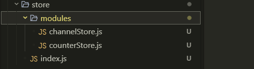

1. 通常集中状态管理的部分都会单独创建一个单独的 ‘store’目录
2. 应用通常会有多个子store模块，所以创建一个 `modules`目录，在内部编写业务分类的字store
3. store中的入口文件 index.js 的作用是组合 modules 中所有的子模块，并导出 store

 基本使用：
1、为React注入store
react-redux负责把Redux和React链接起来,内置 Provider 组件 通过 store 参数创建好的store实例注入到应用中，链接正式建立
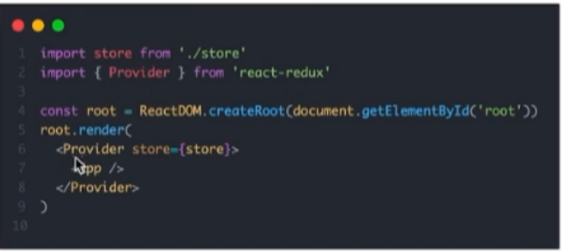
2、React组件使用store中的数据
在React组件中使用store的数据，需要用到一个 钩子函数 userSelector,它的作用是把store中的数据映射到组件中：
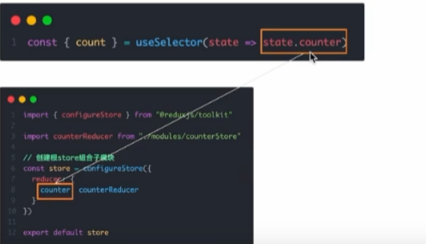
3、React组件修改store中的数据
React组件中修改store中的数据需要借另外一个hook函数 useDispatch,它的作用是生成提交action对象的dispatch函数，使用样例如下：
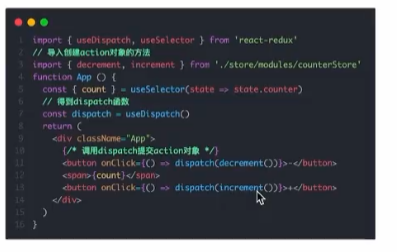

提交action传参实现需求
在reducers的同步修改方法中添加action对象参数，在调用 actionCreater的时候传递参数，参数会被传递到action对象payload属性上
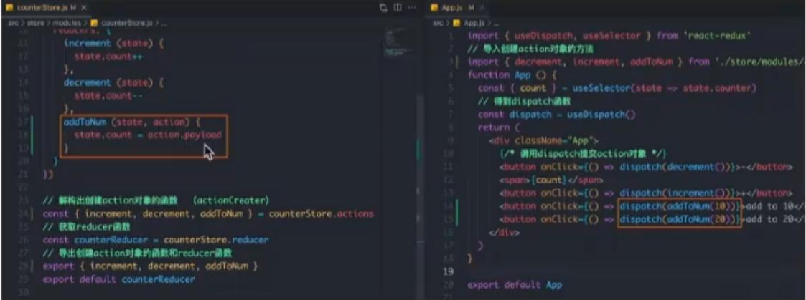

异步操作样板代码：

1. 创建store的写法保持不变，配置好同步修改状态的方法
2. 单独封装一个函数，在函数内部return一个新函数，在新函数中：
  2.1 封装异步请求获取数据
  2.2 调用同步actionCreator传入异步数据生成一个action对象，并用deispatch提交
3. 组件中dispatch的写法保持不变
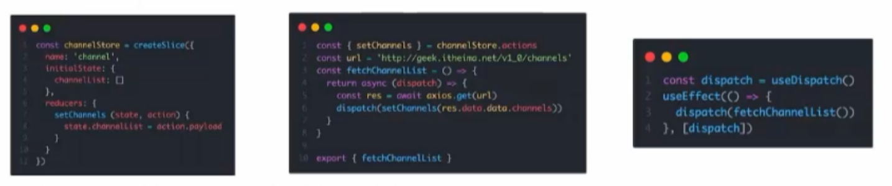

二十二、美团案例
准备并熟悉环境

1. 克隆项目到本地（内置了基础静态组件和模版）<http://git.itcast.cn/heimaqianduan/redux-meituan>
2. 安装所有依赖  npm install
3. 启动mock服务(内置了json-server) npm run serve
4. 启动前端服务 npm run star

二十三、创建路由开发环境
使用路由我们还是采用CRA创建项目的方式进行基础环境配置

1. 创建项目并安装所有依赖
npx create-react-app react-router-pro
npm install
2. 安装最新的 ReactRouter包
npm install react-router-dom
3. 启动项目
npm run start

代码示例：最基本路由创建
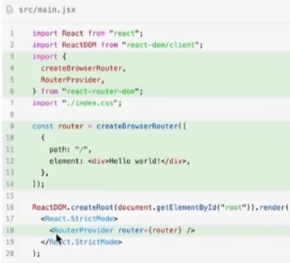

ReactRouter-路由导航
路由系统中的多个路由之间需要进行路由跳转，并且在跳转的同时有可能需要传递参数进行通信

一、声明式导航：
声明式导航是指通过在模板中通过‘<Link/>’组件描述出要跳转到哪里去，比如后台管理系统的左侧菜单通常使用这种方式进行
语法说明：通过给组件的to属性指定要跳转到路由path,组件会被渲染为浏览器支持的a链接，如果需要传参直接通过字符串破解的方式破解参数即可

```javascript
import { Link } from "react-router-dom";
<Link to="/home">首页</Link>
```

路由导航传参：
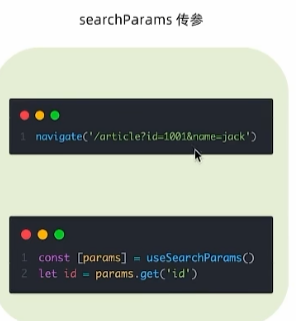
获取传参代码示例：

```javascript
import { useNavigate, useSearchParams } from "react-router-dom";

function Article() {
  const navigate = useNavigate();
  const [params] = useSearchParams();
  const id = params.get("id");
  const name = params.get("name");
  return (
    <div>
      <h1>文章页</h1>
      <p>id: {id}</p>
      <p>name: {name}</p>
      <button onClick={() => navigate("/login")}>去登录页</button>
    </div>
  );
}

export default Article;

```

二、编程式导航
编程式导航是指通过 ‘useNavigate’ 钩子得到导航方法，然后通过调用方式以命令式的形式进行路由跳转，比如想在登陆请求完毕之后跳转就可以选择这种方式，更加灵活
语法说明：通过调用 navigate方法传入地址path实现跳转
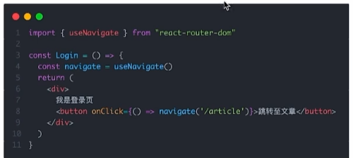
路由导航传参
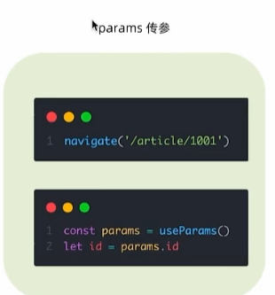
注意：在路由也要添加一步参数配置：

```javascript
{
    path: "/login/:id",
    element: <Login></Login>,
  },
```

二十四、嵌套路由
在一级路由又内嵌了其他路由，这种关系就叫做嵌套路由，嵌套至一级路由内的路由又称作二级路由，例如下图所示：
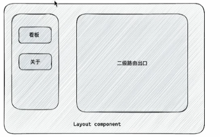
实现步骤：

1. 使用children属性配置路由嵌套关系
2. 使用`<Outlet/>`组件配置二级路由渲染位置
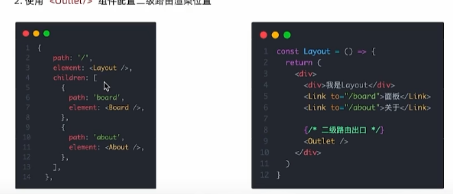

二十五、404路由
场景：当浏览器输入url的路径在整个路由配置中都找不到对应的path，为了用户体验，可以使用404兜底组件进行渲染
实现步骤：

1. 准备一个NotFound组件
2. 在路由表数组的末尾，以*号座位路由path配置路由
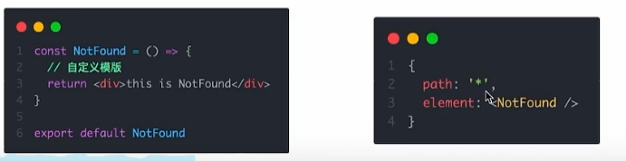

二十六、两种路由模式
在各个主流框架的路由常用的路由模式有两种，history模式和hash模式，ReactRouter分别由createBrowerRouter和createHashRouter函数负责创建
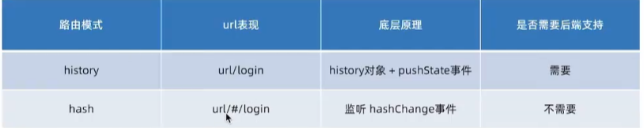

二十七、别名路径配置

1. 路径解析配置（webpack），把 @/ 解析为 src/
2. 路径联想配置（vscode），在vscode中输入@/时，能够联想出 src/ 目录下的文件
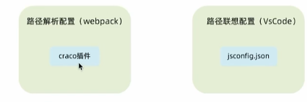
路径解析配置
CRA本身把webpack配置包装到了黑盒里无法直接修改，需要借助一个插件 - craco
配置步骤：
  安装craco: npm install -D @craco/craco
  项目根目录下创建配置文件：craco.config.js
  配置文件中添加路径解析配置
  包文件中配置启动和打包命令
  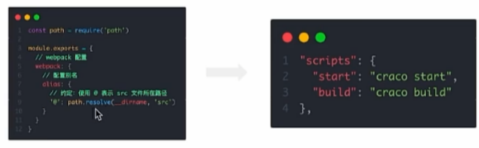

联想路径配置：
VsCode的联想配置，需要我们在项目目录下添加 jsconfig.json 文件，加入配置之后VsCode会自动读取配置帮助我们自动联想配置
配置步骤：
  根目录下新增配置文件 - jsconfig.json
  添加路径提示配置
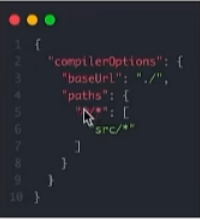

二十八、json-sercer实现数据Mock
json-server是一个node包，可以在不到30秒内获得零编码的完整的Mock服务
实现步骤：
项目中安装 json-server：npm install -D json-server
准备json文件
添加启动命令
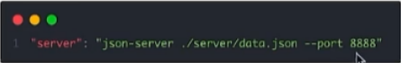
访问接口进行测试
