# 系统架构图解

本文档使用 **Mermaid** 图表语言可视化展示系统的各个架构层次和交互流程。

---

## 1. 整体架构图

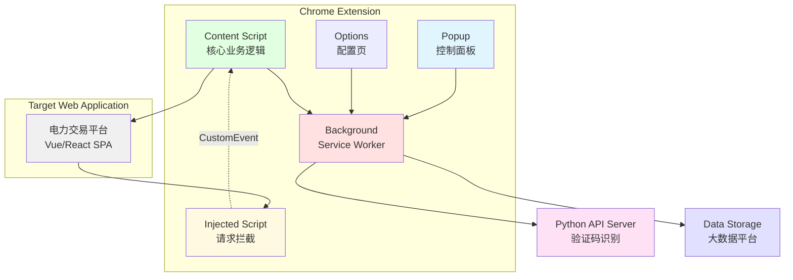

---

## 2. Chrome Extension 内部架构

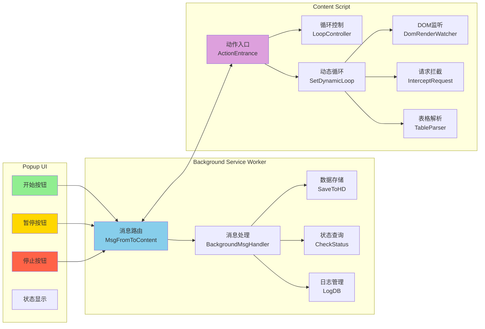

---

## 3. 数据流向图

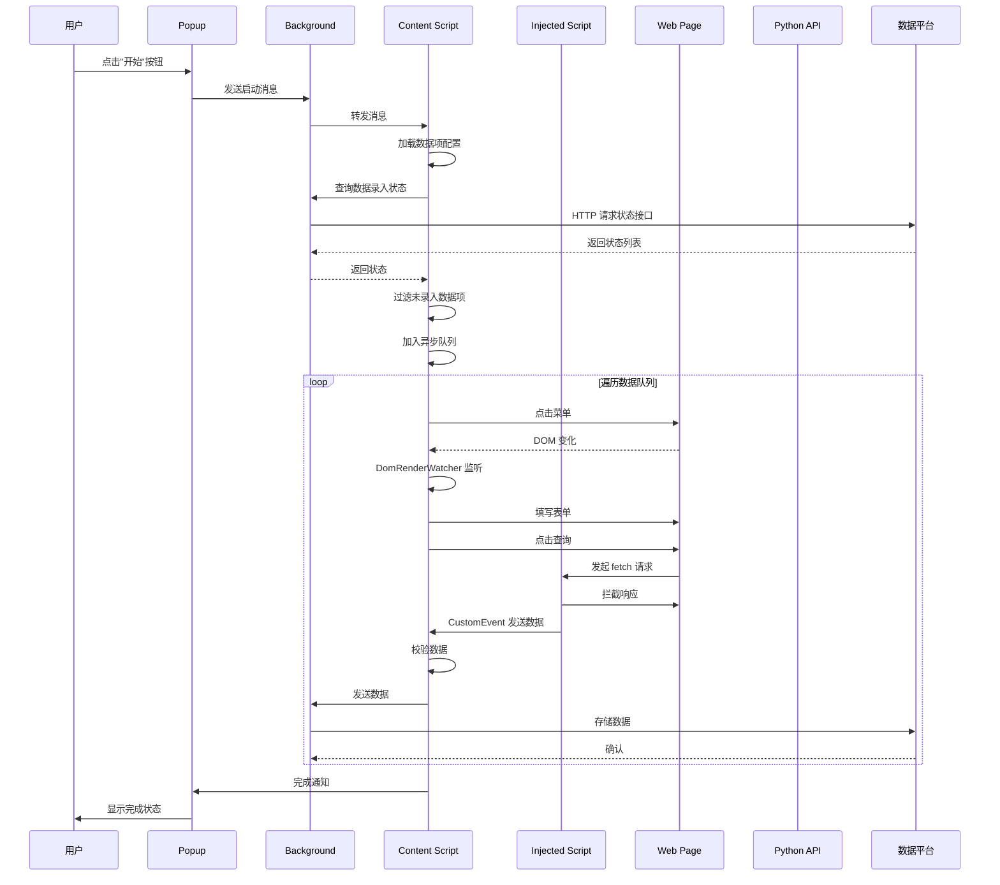

---

## 4. 状态机图（LoopController）

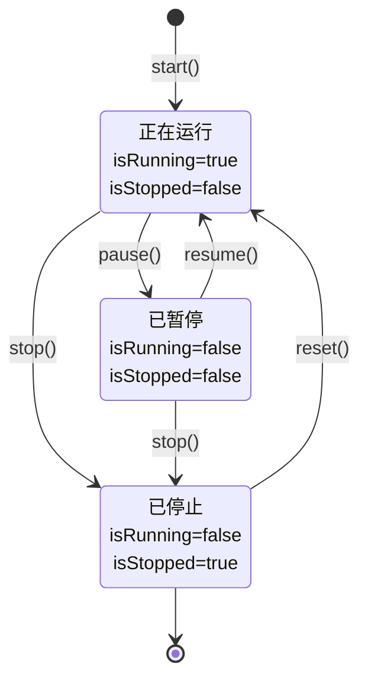

---

## 5. 任务调度流程图

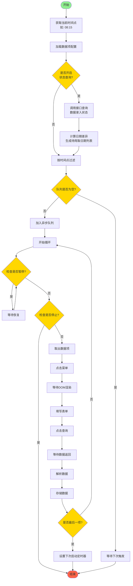

---

## 6. DOM 渲染监听机制

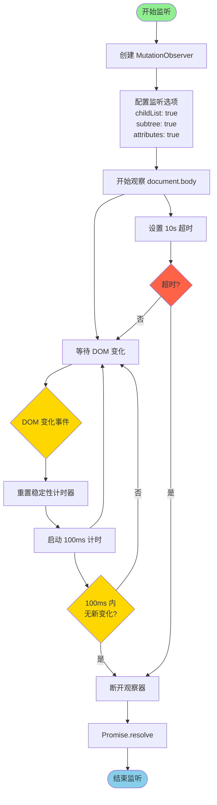

---

## 7. 请求拦截架构

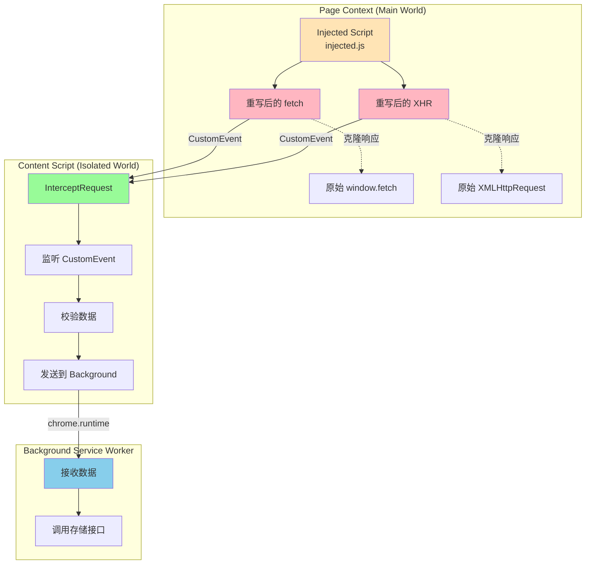

---

## 8. 表格解析算法

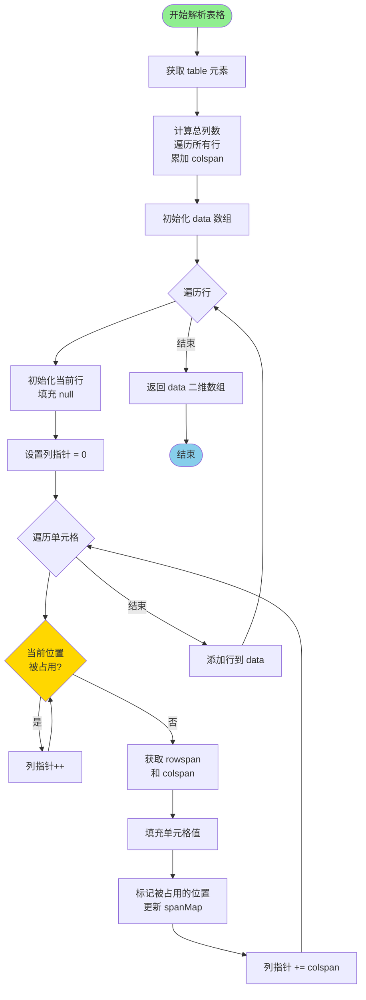

**spanMap 示例**:
```
表格:
┌───┬───┬───┐
│ A │   B   │  (B colspan=2)
│   ├───┬───┤  (A rowspan=2)
│   │ C │ D │
└───┴───┴───┘

spanMap:
{
  '0,2': true,  // 第1行第3列被B占用
  '1,0': true,  // 第2行第1列被A占用
  '1,2': true   // (示例，实际取决于具体情况)
}

解析结果:
[
  ['A', 'B', 'B'],
  ['A', 'C', 'D']
]
```

---

## 9. 多省份构建配置

```mermaid
graph TB
    subgraph "构建命令"
        A[npm run devAH]
        B[npm run prodAH]
        C[npm run prodAHH]
        D[npm run devBJ]
        E[npm run prodBJ]
        F["... (共12个命令)"]
    end
    
    subgraph "Vite 构建流程"
        G[解析 mode 参数<br/>如: devAnHui]
        H[调用 getManifest(mode)]
        I[生成 manifest.json]
        J[替换环境变量]
        K[选择图标目录<br/>iconsDev/iconsProd]
        L[打包输出<br/>dist/devAnHui/]
    end
    
    subgraph "配置文件"
        M[config/systems.ts<br/>省份URL配置]
        N[dataInfoConfig/AnHui/<br/>数据项配置]
        O[.env.devAnHui<br/>环境变量]
    end
    
    A --> G
    B --> G
    C --> G
    D --> G
    E --> G
    F --> G
    
    G --> H
    H --> M
    H --> N
    H --> O
    
    H --> I
    H --> J
    H --> K
    
    I --> L
    J --> L
    K --> L
    
    style A fill:#90EE90
    style B fill:#FFD700
    style C fill:#FF6347
    style L fill:#87CEEB
```

---

## 10. 数据配置层次结构

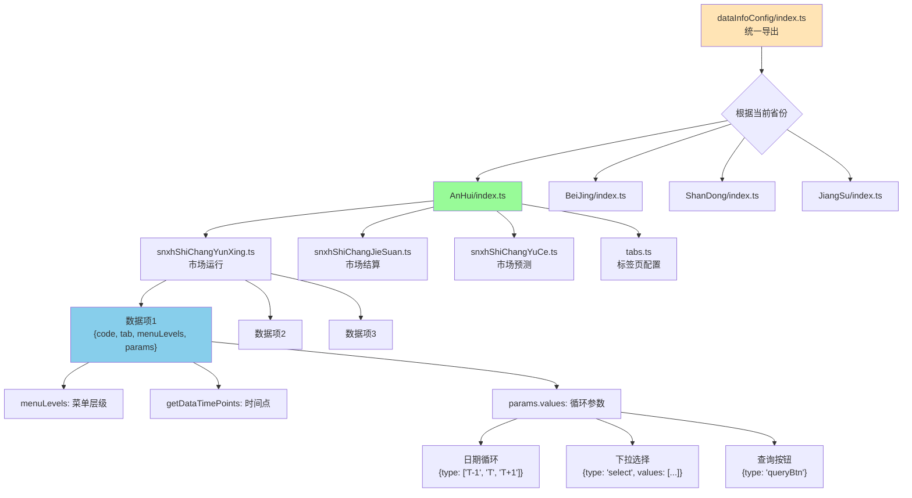

---

## 11. 异步队列工作原理

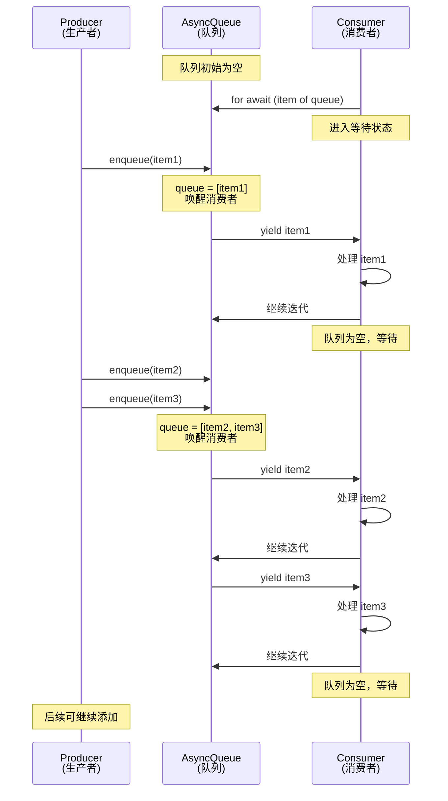

**关键代码**:
```typescript
async *[Symbol.asyncIterator](): AsyncGenerator<T> {
  while (true) {
    if (this.queue.length === 0) {
      // 队列为空，创建 Promise 等待
      await new Promise<void>((resolve) => {
        this.resolve = resolve
      })
    }
    // 取出队首元素
    yield this.queue.shift() as T
  }
}
```

---

## 12. 消息通信架构

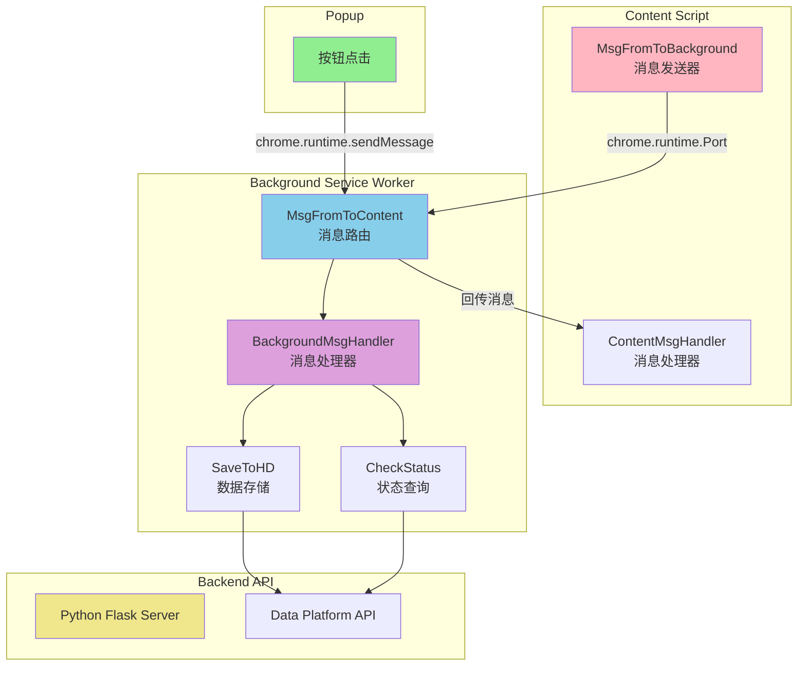

**消息类型**:
- `saveDataInfo`: 保存数据
- `checkStatus`: 查询录入状态
- `contentReady`: Content Script 准备就绪
- `memoryRecord`: 记录内存日志
- `queryValueWrong`: 查询参数错误

---

## 13. 性能优化策略

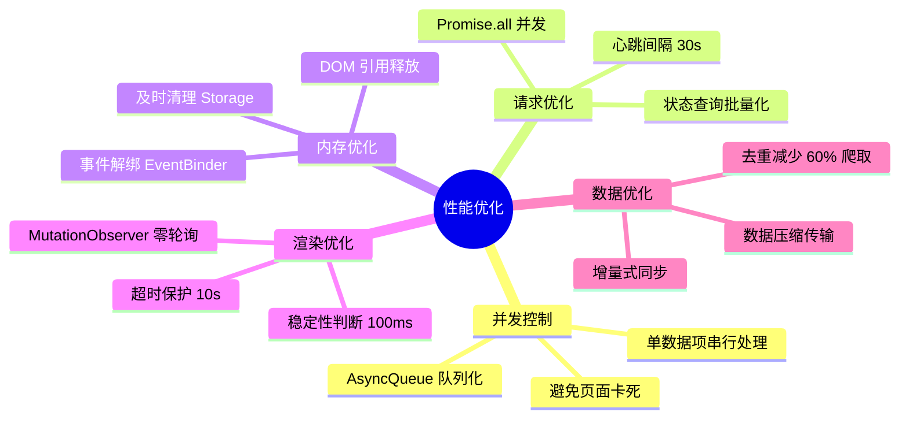

---

## 14. 错误处理流程

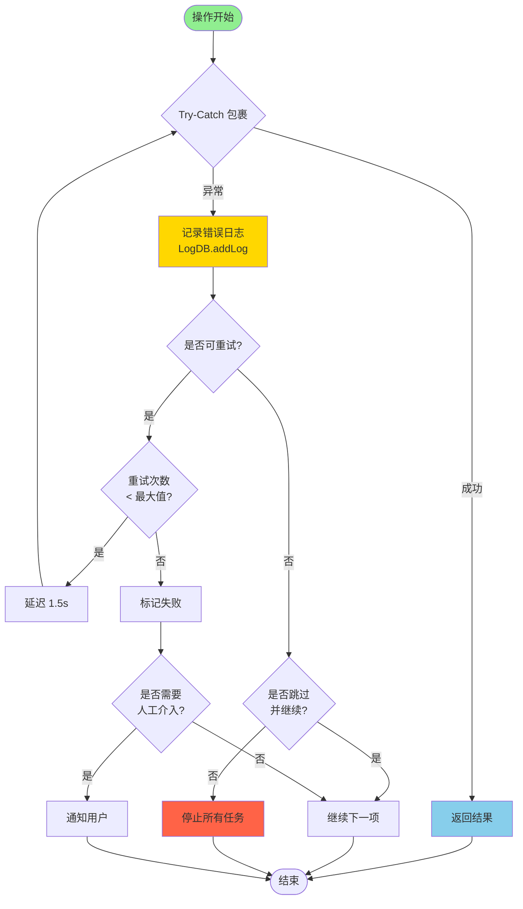

---

## 15. 部署与运行流程

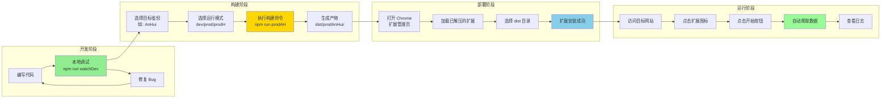

---

## 16. 技术栈全景图

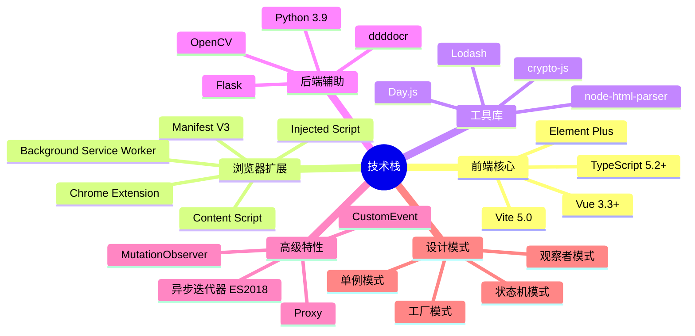

---

## 总结

以上 16 张图表从不同维度展示了系统的架构设计：

1. **整体架构** - 宏观视角
2. **内部架构** - 模块划分
3. **数据流向** - 交互时序
4. **状态机** - 状态转换
5. **任务调度** - 流程控制
6. **DOM监听** - 渲染捕获
7. **请求拦截** - 数据获取
8. **表格解析** - 算法实现
9. **构建配置** - 工程化
10. **配置层次** - 模块组织
11. **异步队列** - 并发控制
12. **消息通信** - 组件通信
13. **性能优化** - 优化策略
14. **错误处理** - 异常处理
15. **部署运行** - 完整流程
16. **技术栈** - 全景总览

这些图表可以直接在支持 Mermaid 的 Markdown 编辑器中渲染（如 Typora、VS Code、GitHub），也可以导出为 PNG/SVG 用于文档和演示。

---

**文档版本**: v1.0  
**最后更新**: 2025年11月  
**适用工具**: Typora、VS Code、GitHub、GitLab、Obsidian


